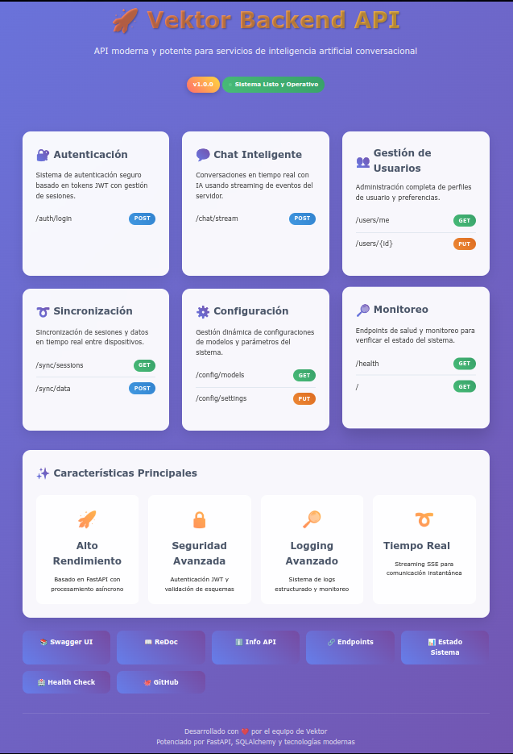
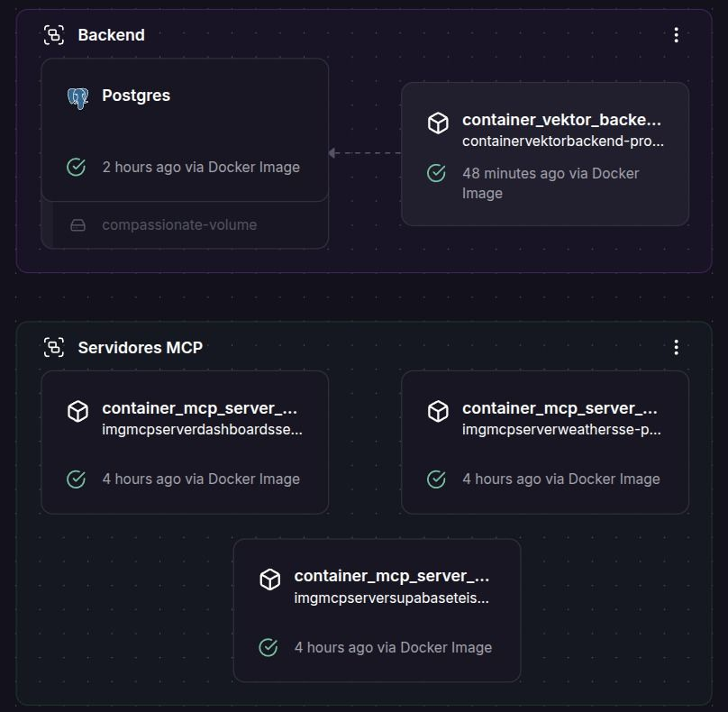

<center>
   # Vektor Backend
  
</center>
```
```
:::info
## 🚀 Descripción General
:::
Vektor Backend es una robusta API basada en FastAPI que impulsa la plataforma de asistente IA Vektor. Ofrece:
- Chat en streaming en tiempo real (Server-Sent Events, SSE)
- Soporte para MCP (Protocolo de Control de Modelos) distribuido
- Sistema completo de autenticación JWT
- Monitoreo avanzado con health checks y paneles de métricas
- Sincronización de sesiones en múltiples dispositivos
- Manejo asíncrono de alto rendimiento
- Logs estructurados con rotación y compresión
<center>


</center>
```
```
:::info
## ✨ Características Principales
:::
- **Streaming en Tiempo Real:** respuestas instantáneas vía SSE  
- **Integración MCP:** balance de carga y failover entre servidores MCP  
- **Autenticación JWT:** tokens con expiración configurable  
- **Monitoreo Avanzado:** endpoints `/health`, `/api/status`, `/metrics`  
- **Sincronización:** respaldo y restauración de datos  
- **Alto Rendimiento:** FastAPI + Uvicorn/Gunicorn  
- **Registro Detallado:** Loguru para trazabilidad
```
```
:::info
## 🛠️ Stack Tecnológico
:::
- **Framework:** FastAPI  
- **Base de Datos:** PostgreSQL + SQLAlchemy (async)  
- **Migraciones:** Alembic  
- **Autenticación:** JSON Web Tokens  
- **Despliegue:** Uvicorn, Gunicorn  
- **Logs:** Loguru (rotación y compresión)  
- **Docs:** Swagger UI & ReDoc
```
```
:::info
## 📋 Prerrequisitos
:::
- Python ≥ 3.12  
- PostgreSQL  
- Gestor de paquetes **uv**:  
  https://docs.astral.sh/uv/getting-started/installation/
```
```
:::info
## 🔧 Instalación
:::
1. **Clonar repositorio**  
   ```bash
   git clone https://github.com/Snayderstone/Vektor
   cd Vektor/backend
   ```
2. **Configurar entorno**  
   ```bash
   cp .env.example .env
   # Editar .env con tus credenciales
   ```
3. **Instalar dependencias**  
   ```bash
   uv sync
   ```
4. **Inicializar configuración y base de datos**  
   ```bash
   uv run scripts/init_config.py
   uv run scripts/init_db.py
   ```
5. **Crear usuario admin**  
   ```bash
   uv run scripts/startup.py --user --email <email> --username <nombre> --password <contraseña>
   ```
6. **Ejecutar servidor**  
   - Desarrollo:  
     ```bash
     python main.py
     ```
   - Producción (Gunicorn):  
     ```bash
     python main.py prod
     ```
```
```
:::info
## 🌐 Configuración (.env)
:::
| Clave                        | Descripción                              | Valor por defecto |
|------------------------------|------------------------------------------|-------------------|
| DATABASE_URL                 | URL de conexión PostgreSQL               | *requerido*       |
| BACKEND_CORS_ORIGINS         | Orígenes CORS permitidos                 | []                |
| SECRET_KEY                   | Clave secreta JWT                        | *requerido*       |
| ACCESS_TOKEN_EXPIRE_MINUTES  | Expiración del token de acceso (minutos) | 60                |
| REFRESH_TOKEN_EXPIRE_DAYS    | Expiración del token de refresh (días)   | 30                |
| LOG_LEVEL                    | Nivel de log (INFO, DEBUG, etc.)         | INFO              |
| LOG_FORMAT                   | Formato de log (structured o simple)     | structured        |
```
```
:::info
## 🚪 Endpoints de API
:::
:::note
### 🔐 Autenticación
:::
- `POST /auth/login`  
   Autentica usuario y devuelve token Bearer. 
- `POST /auth/register`  
  Crea nueva cuenta.  
- `POST /auth/refresh`  
  Renueva token expirado.  
- `POST /auth/logout`  
  Invalida token actual.
:::note
### 💬 Chat
:::
- `POST /chat/stream`  
  Chat streaming vía SSE.  
- `GET /chat/history`  
  Lista todas las conversaciones.  
- `GET /chat/history/{conversation_id}`  
  Obtiene una conversación específica.  
- `DELETE /chat/history/{conversation_id}`  
  Elimina una conversación.  
- `GET /chat/models`  
  Lista modelos IA disponibles.
:::note
### 👤 Usuarios
:::
- `GET /users/me`  
  Perfil del usuario actual.  
- `PUT /users/me`  
  Actualiza email, nombre o avatar.  
- `DELETE /users/me`  
  Elimina cuenta y datos asociados.  
- `POST /users/change-password`  
  Cambia la contraseña.  
- `GET /users/preferences`  
  Obtiene preferencias (tema, notificaciones).  
- `PUT /users/preferences`  
  Actualiza preferencias.
:::note
### 📊 Sistema y Monitoreo
:::
- `GET /health`  
  Verificación de salud: `{ "status": "ok" }`.  
- `GET /api/status`  
  Panel de métricas en JSON.  
- `GET /api/info`  
  Info de versiones, límites y capacidades.  
- `GET /api/endpoints`  
  Lista todos los endpoints.
```
```
:::info
## 📚 Documentación
:::
- Swagger UI: http://localhost:8000/docs  
- ReDoc: http://localhost:8000/redoc  
- OpenAPI JSON: http://localhost:8000/openapi.json  
- Dashboard: http://localhost:8000/
```
```
:::info
## 🔍 Registro y Monitoreo
:::
- Logs en `logs/app.log`, `logs/api.log`, `logs/error.log`  
- Métricas en `/metrics`, `/api/status`
```
```
:::info
## 🔒 Seguridad
:::
- JWT obligatorio salvo en auth.  
- Rate-limiting en endpoints críticos.  
- Contraseñas hasheadas con bcrypt.  
- CORS configurable.
```
```
:::info
## 🐳 Docker
:::
```bash
docker-compose up -d
docker-compose ps
docker-compose logs -f backend
```
```
```
:::info
## 🧪 Pruebas
:::
En la carpeta `test/` ejecuta:
```bash
python -m pytest
```
```
```
:::info
## 🛣️ Hoja de Ruta
:::
- Soporte para más LLM.  
- Mejoras en monitoreo y análisis.  
- Capa de caché.  
- WebSocket bidireccional.
```
```
:::info
## 🔗 Proyectos Relacionados
:::
- Vektor Frontend  
- Servidores MCP de Vektor (GitHub)
```
```
:::info
## 📄 Licencia
:::
Licenciado bajo la Licencia de Código Abierto de Vektor. Consulta el archivo `LICENSE`.
```
```