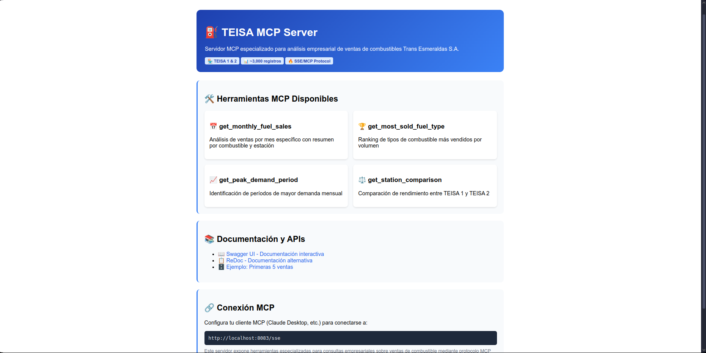
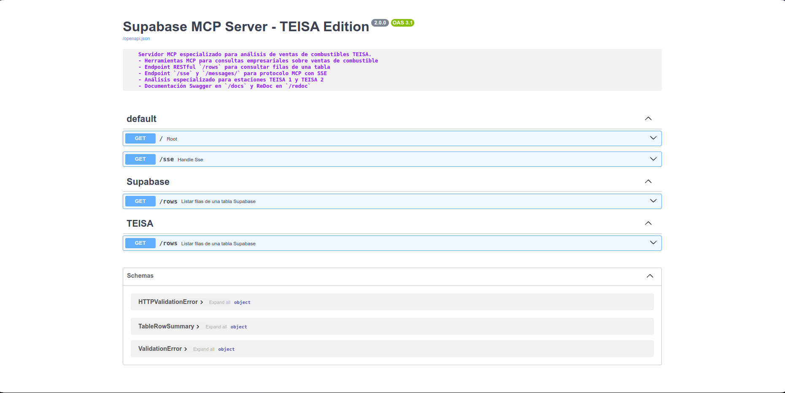
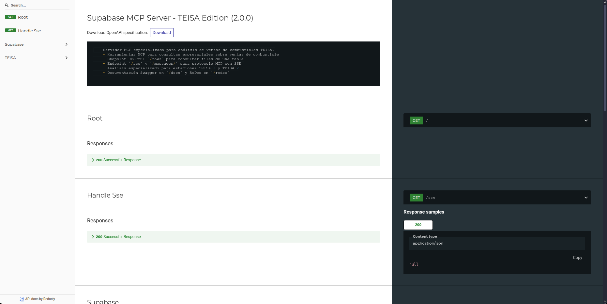
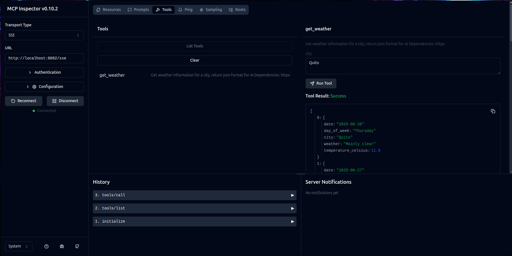

:::info
## 📋 Índice
:::
- [Características](#características)
- [Requisitos previos](#requisitos-previos)
- [Instalación y ejecución local](#instalación-y-ejecución-local)
- [Integración con clientes MCP](#integración-con-clientes-mcp)
- [Herramientas MCP disponibles](#herramientas-mcp-disponibles)
- [Endpoints REST y documentación](#endpoints-rest-y-documentación)
- [Variables de entorno](#variables-de-entorno)
- [Docker](#docker)
- [Notas importantes](#notas-importantes)
- [Dependencias](#dependencias)
:::info
## ✨ Características
:::
- **Análisis especializado TEISA**: Herramientas MCP diseñadas para ventas de combustibles en estaciones TEISA 1 y TEISA 2
- **Protocolo MCP completo**: Server-Sent Events (SSE) para integración con asistentes de IA
- **API REST documentada**: Endpoints con Swagger UI y ReDoc
- **Consultas empresariales avanzadas**: Análisis de demanda, comparación de estaciones y ranking de combustibles
- **Gestión de ~3,000 registros**: Procesamiento eficiente de datos de ventas
- **Docker-ready**: Imagen lista para producción
:::info
## 🔧 Requisitos previos
:::
- Python 3.13 o superior
- uv (gestor de entornos virtuales)
- Cuenta y proyecto activo en Supabase
- Variables de entorno: `SUPABASE_URL` y `SUPABASE_SERVICE_KEY`
:::info
## 🚀 Instalación y ejecución local
:::
### 1. Instalar uv (Gestor de entornos para Python)

```bash
curl -LsSf https://astral.sh/uv/install.sh | sh
uv --version
```

### 2. Clonar y configurar el proyecto

```bash
git clone https://github.com/snayderstone/mcp_supabase.git
cd mcp_supabase
uv venv .venv
source .venv/bin/activate
uv sync
```

### 3. Configurar variables de entorno

```bash
echo "SUPABASE_URL=tu_url_de_supabase" > .env
echo "SUPABASE_SERVICE_KEY=tu_clave_de_servicio" >> .env
# o export directamente
export SUPABASE_URL="tu_url_de_supabase"
export SUPABASE_SERVICE_KEY="tu_clave_de_servicio"
```

### 4. Ejecutar el servidor

```bash
uv run server.py          # SSE (MCP)
uv run server.py --api    # REST API
```

Después verás:
```
🚀 Iniciando TEISA Supabase MCP Server...
📡 Servidor disponible en: http://0.0.0.0:8083
🔗 Endpoint SSE: http://0.0.0.0:8083/sse
📚 Documentación: http://0.0.0.0:8083/docs
⛽ Cargadas 5 herramientas TEISA
```
:::info
## 🔌 Integración con clientes MCP
:::
### Claude Desktop

```json
{
  "mcpServers": {
    "supabase-teisa": {
      "command": "npx",
      "args": ["-y","supergateway","--sse","http://localhost:8083/sse"],
      "disabled": false,
      "autoApprove": []
    }
  }
}
```

### Visual Studio Code

```bash
mkdir .vscode && touch .vscode/mcp.json
```
```json
{
  "servers": {"mcp_supabase_teisa": {"url":"http://localhost:8083/sse"}}
}
```

Usa `Ctrl+Shift+P` → "MCP: Connect to Server" → `mcp_supabase_teisa` y luego "Use Tool" → cualquiera de las herramientas.
:::info
## 🛠️ Herramientas MCP disponibles
:::
1. **get_table_rows**: Filas de cualquier tabla (`table`, `limit`)
2. **get_monthly_fuel_sales**: Ventas por mes (`year`, `month`)
3. **get_most_sold_fuel_type**: Ranking de combustible más vendido
4. **get_peak_demand_period**: Periodos de mayor demanda
5. **get_station_comparison**: Comparación TEISA 1 vs TEISA 2
:::info
## 📖 Endpoints REST y documentación
:::
- **Swagger UI**
  
- **ReDoc** 
  

### Ejemplo REST

```http
GET /rows?table=tbl_ventas_teisa&limit=5
```

```json
[
  {"id":1,"Fecha":"03-15-2024","Estación":"TEISA 1","Tipo_Combustible":"Gasolina Extra","Litros_Vendidos":45.50,"Total_Venta":85.30}
]
```
:::info
## 🔑 Variables de entorno
:::
| Variable               | Descripción                   | Ejemplo                                |
|------------------------|-------------------------------|----------------------------------------|
| `SUPABASE_URL`         | URL de tu proyecto Supabase   | `https://tu-proyecto.supabase.co`     |
| `SUPABASE_SERVICE_KEY` | Service role key de Supabase  | `eyJhbGciOiJIUzI1NiIsInR5cCI6IkpXVCJ9...` |
:::info
## 🔍 Pruebas con MCP Inspector
:::
```bash
npx -y @modelcontextprotocol/inspector
```

:::caution
## ⚠️ Notas importantes
:::
> **Formato Fecha**: Si `Fecha` está en `MM-DD-YYYY`, no cambies o ajusta `get_monthly_fuel_sales` para `YYYY-MM-DD`.

> **Seguridad**: Nunca subas `.env`, usa siempre `SERVICE_KEY`, no `ANON_KEY`.

> **Rendimiento**: Usa `limit` y agregaciones para manejar ~3,000 registros.
:::info
## 📚 Dependencias
:::
- fastapi
- mcp[cli]
- supabase
- httpx
- pandas
- uvicorn

Consulta `pyproject.toml` para más detalles.
