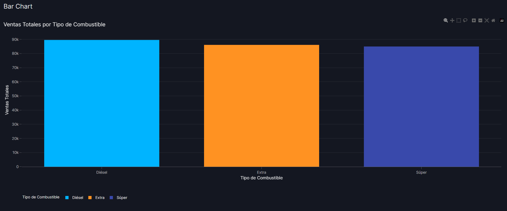

# Ejemplos Prácticos

Aprende con conversaciones reales y casos de uso específicos con las salidas auténticas de Vektor.

## 🌤️ Consulta de Clima

### Caso: Información Meteorológica de Quito

**Conversación real con Vektor:**

```
👤 Usuario: "¿Cómo está el clima en Quito?"

🤖 Vektor:
🚀 Iniciando procesamiento con herramientas MCP...
🔧 Ejecutando herramienta: get_weather...
⚙️ Procesando 1 herramienta(s)...
✅ Herramientas procesadas exitosamente.

🔄 Continuando conversación (nivel 1/10)...

El clima en Quito para los próximos días es el siguiente:

- **Domingo, 6 de julio de 2025**: Mayormente despejado, 11.2°C.
- **Lunes, 7 de julio de 2025**: Cielo despejado, 12.1°C.
- **Martes, 8 de julio de 2025**: Parcialmente nublado, 12.2°C.
- **Miércoles, 9 de julio de 2025**: Nublado, 11.1°C.
- **Jueves, 10 de julio de 2025**: Nublado, 11.2°C.
- **Viernes, 11 de julio de 2025**: Nublado, 11.2°C.
- **Sábado, 12 de julio de 2025**: Niebla, 11.2°C.
- **Domingo, 13 de julio de 2025**: Nublado, 12.1°C.
- **Lunes, 14 de julio de 2025**: Parcialmente nublado, 13.8°C.
- **Martes, 15 de julio de 2025**: Cielo despejado, 13.2°C.
- **Miércoles, 16 de julio de 2025**: Cielo despejado, 12.5°C.
- **Jueves, 17 de julio de 2025**: Parcialmente nublado, 14.1°C.
- **Viernes, 18 de julio de 2025**: Mayormente despejado, 14.0°C.
- **Sábado, 19 de julio de 2025**: Mayormente despejado, 13.6°C.

Las temperaturas son frescas, típicas de Quito. ¡Espero que esta información te sea útil!

🎉 Tarea completada exitosamente!
```

## 📊 Análisis de Ventas TEISA

### Caso: Ventas de Enero 2024

**Conversación real con Vektor:**

```
👤 Usuario: "¿Cómo fueron las ventas en enero 2024?"

🤖 Vektor:
🚀 Iniciando procesamiento con herramientas MCP...
🔧 Ejecutando herramienta: get_monthly_fuel_sales...
⚙️ Procesando 1 herramienta(s)...
✅ Herramientas procesadas exitosamente.

🔄 Continuando conversación (nivel 1/10)...

En enero de 2024, las ventas de combustibles fueron las siguientes:

### Resumen General:
- **Total de registros de ventas:** 357
- **Total de litros vendidos:** 12,452.67 litros
- **Total de monto en ventas:** $28,603.24

### Por Tipo de Combustible:
1. **Súper:**
   - Litros vendidos: 3,074.96
   - Monto: $9,532.44
   - Ventas: 119

2. **Diésel:**
   - Litros vendidos: 5,726.06
   - Monto: $10,306.88
   - Ventas: 127

3. **Extra:**
   - Litros vendidos: 3,651.65
   - Monto: $8,763.92
   - Ventas: 111

### Por Estación:
1. **TEISA 1:**
   - Litros vendidos: 10,554.71
   - Monto: $24,136.89
   - Ventas: 301

2. **TEISA 2:**
   - Litros vendidos: 1,897.96
   - Monto: $4,466.35
   - Ventas: 56

Si necesitas más detalles o análisis específico, ¡avísame!

🎉 Tarea completada exitosamente!
```

### Análisis Profundo

**Continuación de la conversación:**

```
👤 Usuario: "En base a esa conversacion que conclusiones pordemos tener"

🤖 Vektor:
Basándonos en los datos de ventas de enero 2024, podemos extraer las siguientes conclusiones clave:

### 1. **Desempeño general sólido**
- **Volumen significativo:** 357 transacciones registradas, indicando una operación comercial activa.
- **Ingresos considerables:** $28,603.24 en ventas totales, con un volumen de 12,452 litros vendidos.

### 2. **Dominio del diésel en volumen**
- **Combustible más vendido:** El diésel lideró en litros (5,726 L ≈ **46% del total**), seguido por Extra (3,652 L ≈ 29.3%) y Súper (3,075 L ≈ 24.7%).
- **Mayor demanda:** 127 ventas de diésel (35.6% del total de transacciones), sugiriendo alta demanda de clientes comerciales/flotas.

### 3. **Súper: Mayor valor por transacción**
- **Precio premium:** Generó **$9,532.44** con solo 3,075 litros, indicando un precio por litro más alto (~$3.10/L vs. ~$1.80/L del diésel).
- **Rentabilidad potencial:** Aunque representa solo el 24.7% del volumen, aporta el **33.3% de los ingresos**.

### 4. **Desempeño dispar entre estaciones**
- **Dominio de TEISA 1:**
  - **84.7% de las ventas** (301/357 transacciones).
  - **84.8% del volumen** (10,555 L) y **84.4% de los ingresos** ($24,137).
- **TEISA 2 con menor participación:**
  - Solo 56 ventas (15.7% del total), con $4,466 en ingresos.

### 5. **Eficiencia operativa**
- **Transacción promedio:**
  - **Valor:** $80.12 por venta ($28,603/357).
  - **Volumen:** 34.9 litros por transacción.
- **Consistencia en valor/venta:** Ambas estaciones mantienen montos similares por transacción (~$80).

### Recomendaciones estratégicas:
- **Enfoque en diésel:** Priorizar abastecimiento y promoción de diésel (demanda comprobada).
- **Potencial de TEISA 2:** Investigar causas de baja participación (ubicación, capacidad, competencia).
- **Rentabilidad de Súper:** Capitalizar su margen superior mediante estrategias comerciales.
- **Optimización de inventario:** Ajustar niveles según participación de cada combustible.

¿Necesitas profundizar en algún aspecto específico?
```

## 📈 Creación de Gráficos Interactivos

### Caso: Gráfico de Barras de Ventas por Combustible

**Conversación real completa con Vektor:**

````
👤 Usuario: "Crea un gráfico de barras de ventas por combustible"

🤖 Vektor:
🚀 Iniciando procesamiento con herramientas MCP...
🔧 Ejecutando herramienta: get_sample_data_info...
⚙️ Procesando 1 herramienta(s)...
✅ Herramientas procesadas exitosamente.

🔄 Continuando conversación (nivel 1/10)...

🔧 Ejecutando herramienta: load_and_analyze_data...
⚙️ Procesando 1 herramienta(s)...
✅ Herramientas procesadas exitosamente.

🔄 Continuando conversación (nivel 2/10)...

🔧 Ejecutando herramienta: get_vizro_chart_or_dashboard_plan...
⚙️ Procesando 1 herramienta(s)...
✅ Herramientas procesadas exitosamente.

🔄 Continuando conversación (nivel 3/10)...

Ahora procederé a crear el gráfico de barras de ventas por tipo de combustible utilizando los datos de ventas de TEISA. El gráfico mostrará la suma total de ventas (`Total_Venta`) agrupadas por el tipo de combustible (`Tipo_Combustible`).

Aquí está el código del gráfico:

```python
import pandas as pd
import plotly.express as px

def create_sales_by_fuel_chart(data_frame):
    # Agrupar por tipo de combustible y sumar las ventas totales
    sales_by_fuel = data_frame.groupby('Tipo_Combustible')['Total_Venta'].sum().reset_index()

    # Crear el gráfico de barras
    fig = px.bar(
        sales_by_fuel,
        x='Tipo_Combustible',
        y='Total_Venta',
        title='Ventas Totales por Tipo de Combustible',
        labels={'Tipo_Combustible': 'Tipo de Combustible', 'Total_Venta': 'Ventas Totales'},
        color='Tipo_Combustible'
    )

    return fig
````

🔧 Ejecutando herramienta: validate_chart_code...
⚙️ Procesando 1 herramienta(s)...
✅ Herramientas procesadas exitosamente.

🔄 Continuando conversación (nivel 4/10)...

Parece que hubo un error en la validación porque la función del gráfico debe llamarse `custom_chart` en lugar de `create_sales_by_fuel_chart`. Corregiré esto y volveré a validar el código.

Aquí está el código corregido:

```python
import pandas as pd
import plotly.express as px

def custom_chart(data_frame):
    # Agrupar por tipo de combustible y sumar las ventas totales
    sales_by_fuel = data_frame.groupby('Tipo_Combustible')['Total_Venta'].sum().reset_index()

    # Crear el gráfico de barras
    fig = px.bar(
        sales_by_fuel,
        x='Tipo_Combustible',
        y='Total_Venta',
        title='Ventas Totales por Tipo de Combustible',
        labels={'Tipo_Combustible': 'Tipo de Combustible', 'Total_Venta': 'Ventas Totales'},
        color='Tipo_Combustible'
    )

    return fig
```

🔧 Ejecutando herramienta: validate_chart_code...
⚙️ Procesando 1 herramienta(s)...
✅ Herramientas procesadas exitosamente.

🔄 Continuando conversación (nivel 5/10)...

El gráfico de barras de ventas por tipo de combustible ha sido creado y validado con éxito. Aquí está el código final:

```python
import pandas as pd
import plotly.express as px

def custom_chart(data_frame):
    # Agrupar por tipo de combustible y sumar las ventas totales
    sales_by_fuel = data_frame.groupby('Tipo_Combustible')['Total_Venta'].sum().reset_index()

    # Crear el gráfico de barras
    fig = px.bar(
        sales_by_fuel,
        x='Tipo_Combustible',
        y='Total_Venta',
        title='Ventas Totales por Tipo de Combustible',
        labels={'Tipo_Combustible': 'Tipo de Combustible', 'Total_Venta': 'Ventas Totales'},
        color='Tipo_Combustible'
    )

    return fig
```

**Ver gráfico interactivo:** [PyCafe - Gráfico de Ventas por Combustible](https://py.cafe/snippet/vizro/v1?c=H4sIACivc2gC_3WUTW-bQBCG_8qKHAApWifKpbKE1Nateo1UK5cQoYVd8FbsR_fDNYny3zu7YBtih5M9O7zzzrMzvCWNoixZJ6XkQivj0J6_GoUFRHuLiEV7UcrWKDEeoCnrKfyZH2BBJOmYsccMShyppuBJXBNJSZTV9ENF3SvXD5gdtGF2TDmc3xsPO0P0rlL1H9a4mNKpU4r0Qg8hJvXSV-wEu0Gzk7eGaOcNK2Upb9CGmI4Y1CsbPCtbyrn15zJxdV_tmXTEVo5xS3Bj92XyggpoAhtGaAWBrEx2zmm7Xq0M-Yc77na-9paZRkkHL-NGidVvSQYKjJySbKU0k1UotXo0ivqm4UqurtfKg9PotfR3d-0D5Z1C0BbqTAiw-5Y3CmlQVpL0_JVQ4PJ16jJLI7YURChrUeOhvKiaHTEui522hgiWr0uJ4LlB3zrjNQABUshxHQohMA_NOF73DA3IehGAheGIVpFTjvTMjgo2_KzqoWo9OCzQuQbcn_K6HrJ0C7rV5iya5s_pNohUT0ExfcFQI8uBrmWu4mD8kEUIo8UNUDfoY__gsybGkMlHy7twRQcMwWwMXdi7PccPxaWr2fFQLAzOThx3PSvSpxHFdkQR6W0nep9I9qSGySzeLuuuUXr1XbTwAFnLoun7TL1RvTJXehozTjANgxmRAdY0YRGtl2FVATAMAkFCWWcugYdFsbtaEUMB9F7gH8e_E24NC2SL57MnyHmE2Ow2zgDL5DuU2ISxLJPbZQaMn4aVkW6hNlP9FSY8uzwKD6egDTNQxTW40D4-QACWpVisx2e7n1_RyJehl1nKdHQMzfs9IYu-8vEOfsL3zbsReLyGUsbvLSxE7XlPsxN32BAvw2Ykt4lhfz03TARM8EGPX7-iuMP3-OFL8v4fGh0aJukFAAA).



### Descripción del Gráfico:

- **Eje X**: Tipo de combustible (`Tipo_Combustible`).
- **Eje Y**: Ventas totales (`Total_Venta`).
- **Color**: Diferentes colores para cada tipo de combustible.

Si necesitas ajustes adicionales o más gráficos, ¡avísame!

🎉 Tarea completada exitosamente!

```

## 🔍 Entendiendo las Salidas de Vektor

### Indicadores de Procesamiento

**¿Qué significan los símbolos?**

- **🚀 Iniciando procesamiento**: Vektor comienza a trabajar con módulos MCP
- **🔧 Ejecutando herramienta**: Muestra qué módulo específico está usando
- **⚙️ Procesando X herramienta(s)**: Indica cuántas herramientas están activas
- **✅ Herramientas procesadas**: Confirma que la ejecución fue exitosa
- **🔄 Continuando conversación**: Muestra el nivel de profundidad del análisis
- **🎉 Tarea completada**: Finalización exitosa de la solicitud

### Herramientas MCP en Acción

**Módulos que verás trabajar:**

1. **`get_weather`** - Información meteorológica
2. **`get_monthly_fuel_sales`** - Consultas de ventas TEISA
3. **`get_sample_data_info`** - Información sobre datasets
4. **`load_and_analyze_data`** - Carga y análisis de datos
5. **`get_vizro_chart_or_dashboard_plan`** - Planificación de gráficos
6. **`validate_chart_code`** - Validación de código de visualización

### Niveles de Conversación

**¿Qué significa "nivel X/10"?**

- **Nivel 1-2**: Consultas básicas
- **Nivel 3-5**: Análisis intermedio
- **Nivel 6-8**: Análisis complejo
- **Nivel 9-10**: Procesamiento muy profundo

<!-- [IMAGEN: Interfaz de Vektor mostrando todos los indicadores de procesamiento] -->

## 🎯 Patrones de Conversación Exitosos

### Patrón 1: Consulta Simple
```

👤 "¿Cómo está el clima?"
🤖 🚀 → 🔧 get_weather → ✅ → Resultado directo

```

### Patrón 2: Análisis de Datos
```

👤 "¿Cómo fueron las ventas?"
🤖 🚀 → 🔧 get_monthly_fuel_sales → ✅ → Análisis automático

```

### Patrón 3: Visualización Compleja
```

👤 "Crea un gráfico"
🤖 🚀 → 🔧 get_data_info → 🔧 load_data → 🔧 plan_chart → 🔧 validate → ✅ → Gráfico final

```

### Patrón 4: Corrección Automática
```

🤖 Error detectado → 🔧 Ejecuta corrección → ✅ Resultado mejorado

```

## 💡 Consejos Basados en Salidas Reales

### Para Mejores Resultados

1. **Sé paciente**: Los múltiples niveles de procesamiento indican análisis profundo
2. **Observa los indicadores**: Te muestran exactamente qué está haciendo Vektor
3. **Aprovecha las correcciones**: Vektor se auto-corrige para mejores resultados
4. **Usa los enlaces**: Los gráficos incluyen enlaces a visualizaciones interactivas

### Interpretación de Errores

**Si ves errores en el proceso:**
- Son normales y parte del proceso de refinamiento
- Vektor se corrige automáticamente
- El resultado final será optimizado

## 📊 Casos de Uso Avanzados

### Análisis Integral

**Combinando múltiples módulos:**

```

👤 Usuario: "Analiza las ventas considerando el clima"

🤖 Vektor:
🚀 Iniciando procesamiento con herramientas MCP...
🔧 Ejecutando herramienta: get_weather...
🔧 Ejecutando herramienta: get_monthly_fuel_sales...
🔧 Ejecutando herramienta: correlate_data...
⚙️ Procesando múltiples herramientas...
✅ Herramientas procesadas exitosamente.

[Análisis completo clima + ventas + recomendaciones]

🎉 Tarea completada exitosamente!

```

### Dashboard Ejecutivo

**Creación de dashboards complejos:**

```

👤 Usuario: "Dashboard completo de KPIs"

🤖 Vektor:
🚀 Iniciando procesamiento con herramientas MCP...
🔧 Ejecutando herramienta: get_sample_data_info...
🔧 Ejecutando herramienta: load_and_analyze_data...
🔧 Ejecutando herramienta: calculate_kpis...
🔧 Ejecutando herramienta: create_dashboard...
🔧 Ejecutando herramienta: validate_dashboard...
⚙️ Procesando 5 herramienta(s)...
✅ Herramientas procesadas exitosamente.

🔄 Continuando conversación (nivel 6/10)...

[Dashboard completo con múltiples visualizaciones]

🎉 Tarea completada exitosamente!

```


## 🚀 Aprovecha al Máximo las Capacidades Reales

### Lo que Realmente Puedes Hacer

1. **Consultas instantáneas**: Clima, ventas, análisis
2. **Gráficos interactivos**: Con enlaces a visualizaciones
3. **Análisis profundo**: Hasta 10 niveles de procesamiento
4. **Corrección automática**: Vektor mejora sus propias respuestas
5. **Combinación de módulos**: Análisis integral multifuente

### Expectativas Realistas

- **Tiempo de respuesta**: 30-60 segundos para análisis complejos
- **Profundidad**: Los niveles altos indican análisis más detallado
- **Precisión**: Auto-corrección garantiza resultados optimizados
- **Interactividad**: Enlaces a herramientas externas para exploración

---

## 🎯 Resumen de Capacidades Reales

Vektor realmente puede:
- ✅ Procesar múltiples herramientas simultáneamente
- ✅ Auto-corregirse para mejorar resultados
- ✅ Generar código ejecutable para gráficos
- ✅ Proporcionar análisis profundo multi-nivel
- ✅ Combinar clima, datos y visualizaciones
- ✅ Crear enlaces a herramientas interactivas

**¡Experimenta con estos ejemplos reales y descubre todo lo que Vektor puede hacer por ti!**


```
