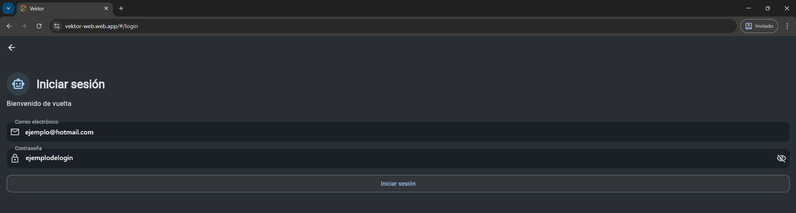
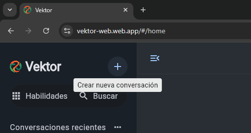
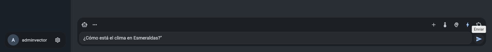
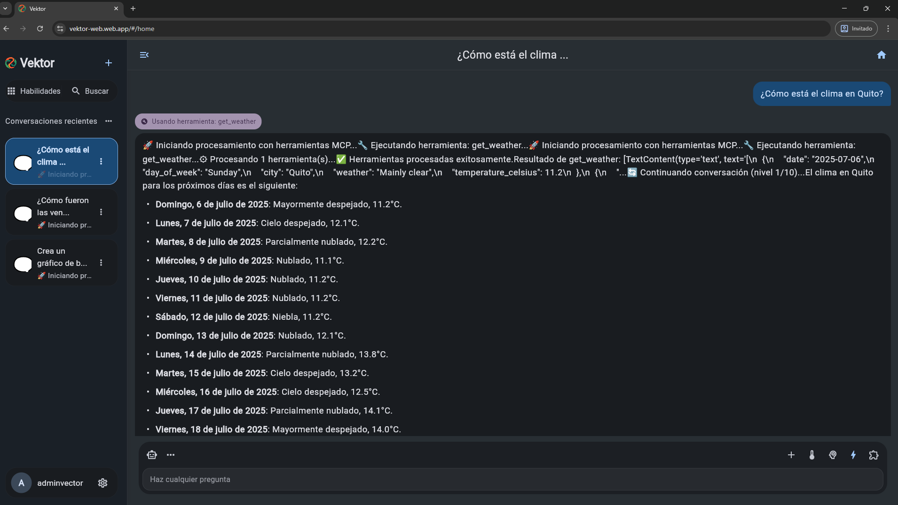
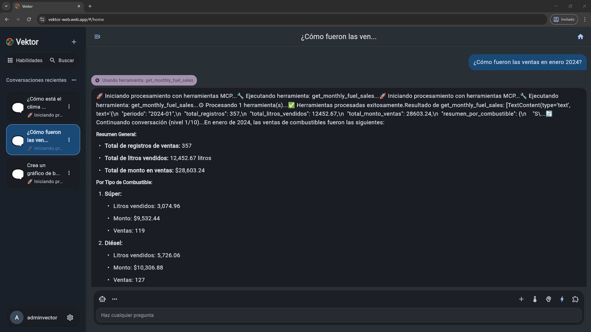
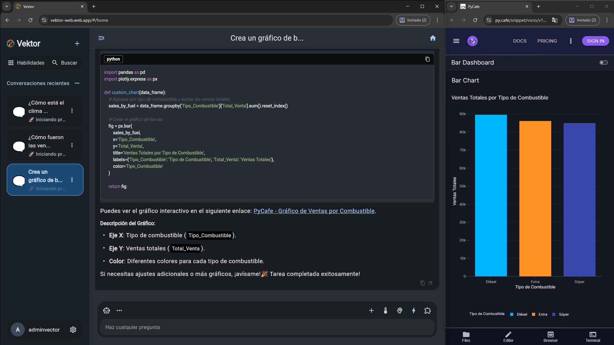
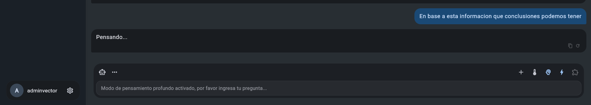
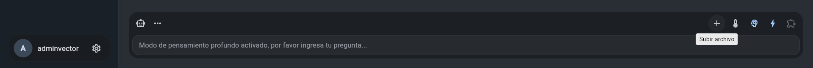
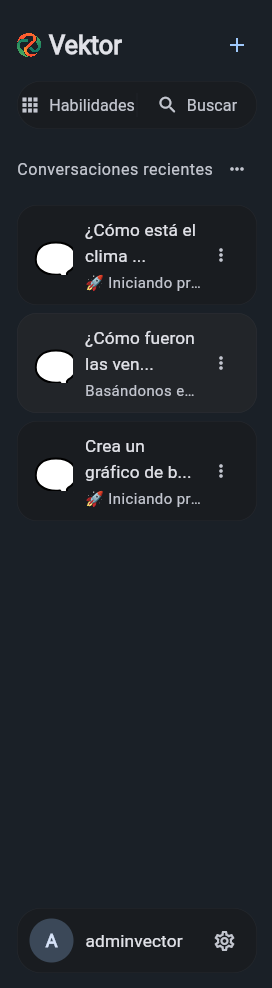
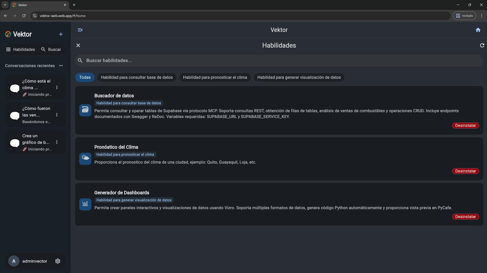

# Guía Rápida de Vektor

Tu asistente de IA para chat, análisis de datos y dashboards interactivos.

## 🚀 Acceso Inmediato

### Aplicación Web (Recomendada)

**URL:** [https://vektor-web.web.app](https://vektor-web.web.app)

### Aplicación Móvil

**Descarga:** [APK Android](https://mega.nz/folder/T4s0HRTI#iYR-9bRs5MlHW6g_gifSzg/file/q58zQQBY)

### Credenciales de Acceso

```
Email: admin@vektor.com
Usuario: adminvector
Contraseña: 2846Vektor@.
```

<!-- [IMAGEN: Pantalla de login con credenciales] -->



## 💬 Usar Vektor (3 pasos)

### Paso 1: Iniciar Conversación

1. Haz clic en **"Nuevo Chat"**

   {" "}

   <div style={{ textAlign: "center" }}></div>

2. Escribe tu pregunta

   

3. Presiona **Enter**

<!-- [GIF: Crear nuevo chat y escribir primer mensaje] -->

### Paso 2: Tipos de Consultas

#### 🌤️ Información del Clima



```
Pregunta: "¿Cómo está el clima en Quito?"
Respuesta: Temperatura, condiciones y pronóstico detallado
```

#### 📊 Análisis de Datos TEISA



```
Pregunta: "¿Cómo fueron las ventas en enero 2024?"
Respuesta: Análisis completo con números y tendencias
```

#### 📈 Crear Gráficos



```
Pregunta: "Crea un gráfico de barras de ventas por combustible"
Respuesta: Gráfico interactivo con datos reales
```

<!-- [IMAGEN: Ejemplos de diferentes tipos de respuestas] -->

### Paso 3: Funciones Avanzadas

#### 🧠 Modo Pensamiento Profundo



- **Cuándo usar:** Análisis complejos
- **Cómo activar:** Haz clic en el icono del cerebro 🧠
- **Ejemplo:** "Analiza las tendencias de ventas y dame estrategias"

#### 📎 Adjuntar Archivos



- **Formatos:** PDF, CSV, TXT, PNG, JPG (máx. 10MB)
- **Cómo:** Arrastra el archivo o haz clic en +
- **Uso:** "Analiza este archivo CSV"

<!-- [IMAGEN: Interfaz mostrando modo pensamiento y adjuntar archivos] -->

## ⚙️ Personalización Rápida

### Cambiar Tema

- **Menú:** Configuración ⚙️ → Apariencia
- **Opciones:** Claro 🌞 / Oscuro 🌙 / Automático 🔄

### Cambiar Idioma

- **Menú:** Configuración ⚙️ → Idioma
- **Opciones:** Español 🇪🇸 / English 🇺🇸

<!-- [IMAGEN: Pantalla de configuración] -->

## 🎯 Consejos para Mejores Resultados

### ✅ Preguntas Efectivas

- **Específico:** "Ventas de gasolina en enero 2024" ✅
- **Evitar:** "Dime sobre ventas" ❌

### ⚡ Comandos Útiles

- `@weather [ciudad]` - Clima específico
- `@data [consulta]` - Buscar en base de datos
- `@viz [tipo]` - Crear visualización

### 🔄 Flujo Recomendado

1. **Explora:** Haz preguntas generales
2. **Analiza:** Profundiza con datos específicos
3. **Visualiza:** Crea gráficos de resultados
4. **Decide:** Usa insights para acciones

## 📱 Gestión de Conversaciones

### Historial

- **Ver anteriores:** Panel lateral izquierdo
- **Buscar:** Usa la barra de búsqueda
- **Eliminar:** Botón papelera en cada chat

### Sincronización

- **Automática:** Entre web y móvil
- **Instantánea:** Con tu cuenta
- **Segura:** Datos encriptados

<!-- [IMAGEN: Panel de historial de conversaciones] -->

{" "}

{" "}

<div style={{ textAlign: "center" }}></div>

## 🔧 Solución Rápida de Problemas

### No puedo iniciar sesión

1. Verifica credenciales exactas
2. Limpia caché: `Ctrl + Shift + R`
3. Prueba modo incógnito

### No recibo respuestas

1. Verifica conexión a internet
2. Recarga página: `F5`
3. Espera 30 segundos

### Errores con archivos

1. Verifica formato (PDF, CSV, TXT, PNG, JPG)
2. Tamaño máximo: 10MB
3. Renombra sin espacios

## 🚀 Domina Vektor en 5 Minutos

### Minuto 1: Login y Exploración

- Accede con credenciales de admin
- Explora la interfaz principal

### Minuto 2: Primera Pregunta

- Pregunta: "¡Hola! ¿Qué puedes hacer?"
- Observa la respuesta en tiempo real

### Minuto 3: Prueba el Clima

- Pregunta: "¿Cómo está el clima en [tu ciudad]?"

### Minuto 4: Analiza Datos

- Pregunta: "¿Cómo fueron las ventas este año?"
- Activa modo pensamiento profundo

### Minuto 5: Crea un Gráfico

- Pide: "Crea un gráfico de ventas por combustible"

<!-- [IMAGEN: Progreso visual de 5 minutos] -->

## 🎨 Módulos Disponibles



### 🌤️ MCP Weather

**Qué hace:** Pronósticos del clima mundiales
**Ejemplos:**

- "Pronóstico de Quito"
- "Clima de Guayaquil para 7 días"

### 📊 MCP Supabase

**Qué hace:** Análisis de ventas TEISA
**Ejemplos:**

- "¿Qué combustible se vende más?"
- "Compara TEISA 1 vs TEISA 2"

### 📈 MCP Dashboards

**Qué hace:** Visualizaciones interactivas
**Ejemplos:**

- "Dashboard de ventas combustibles"
- "Gráfico de líneas evolución diaria"

## ⚡ Atajos de Teclado

| Atajo           | Función        |
| --------------- | -------------- |
| `Enter`         | Enviar mensaje |
| `Shift + Enter` | Nueva línea    |
| `Ctrl + N`      | Nuevo chat     |
| `Ctrl + H`      | Historial      |
| `Ctrl + ,`      | Configuración  |

## 🔒 Seguridad

- **Tokens JWT:** Sesiones seguras
- **Encriptación:** Datos en tránsito
- **Privacidad:** Sin compartir información personal

---

## 🎉 ¡Listo para Empezar!

Ya tienes todo lo necesario para usar Vektor efectivamente:

1. **Experimenta** con diferentes preguntas
2. **Combina** clima, datos y gráficos
3. **Personaliza** tu experiencia
4. **Explora** nuevas funcionalidades

¿Problemas? Ve a [Solución de Problemas](solucion-problemas) o pregunta directamente: "¿Cómo puedo...?"

**¡Disfruta usando Vektor!** 🚀

<!-- [IMAGEN: Collage de funcionalidades principales] -->
