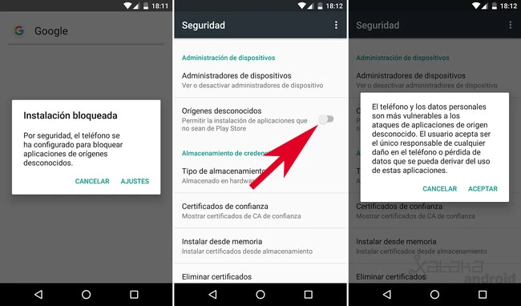

# Solución de Problemas

Soluciones rápidas y efectivas para usar Vektor sin interrupciones.

## 🔐 Problemas de Acceso

### ❌ No puedo iniciar sesión

**Síntomas:**

- "Credenciales inválidas"
- "Error de autenticación"
- Pantalla de login no responde

**Soluciones paso a paso:**

1. **Verifica credenciales exactas:**

   ```
   Email
   Contraseña
   ```

   ⚠️ **Importante:** Incluye el punto final en la contraseña

2. **Limpia caché del navegador:**

   - Chrome: `Ctrl + Shift + R`
   - Firefox: `Ctrl + F5`
   - Safari: `Cmd + Shift + R`

3. **Prueba modo incógnito:**

   - Chrome: `Ctrl + Shift + N`
   - Firefox: `Ctrl + Shift + P`

4. **Verifica la URL correcta:**

   - ✅ Correcta: `https://vektor-web.web.app`
   - ❌ Incorrecta: otros dominios

5. **Cambia de navegador:**
   - Prueba Chrome, Firefox o Edge

<!-- [IMAGEN: Pantalla de login con credenciales correctas resaltadas] -->

### ❌ La aplicación no carga

**Síntomas:**

- Pantalla en blanco
- "Loading..." infinito
- Error "Failed to load"

**Soluciones:**

1. **Recarga forzada:** `Ctrl + F5`
2. **Verifica conexión:** Speed test o ping
3. **Desactiva extensiones:** Modo incógnito para probar
4. **Actualiza navegador:** Última versión disponible
5. **Limpia DNS:** `ipconfig /flushdns` (Windows)

### ❌ App móvil no funciona

**Síntomas:**

- App se cierra al abrir
- "App no responde"
- Error de instalación

**Soluciones Android:**

1. **Permite fuentes desconocidas:**

   ```
   Configuración → Seguridad → Fuentes desconocidas → Activar
   ```

2. **Libera espacio:** Mínimo 500MB disponibles

3. **Verifica versión Android:** Mínimo Android 7.0

4. **Reinstala completamente:**

   - Desinstala la app actual
   - Descarga nueva desde el enlace oficial
   - Instala y reinicia el teléfono

5. **Limpia caché del sistema:**
   ```
   Configuración → Aplicaciones → Vektor → Almacenamiento → Limpiar caché
   ```

<!-- [IMAGEN: Pasos para permitir fuentes desconocidas en Android] -->



## 💬 Problemas de Chat

### ❌ No recibo respuestas

**Síntomas:**

- Mensaje enviado pero sin respuesta
- Indicador "escribiendo..." permanente
- Silencio total del asistente

**Diagnóstico rápido:**

```
1. ¿Hay conexión a internet? → Abre otra página web
2. ¿El mensaje se envió? → Debe aparecer en el chat
3. ¿Hay indicador de carga? → Debe mostrar "escribiendo..."
```

**Soluciones:**

1. **Espera 60 segundos:** El servidor puede estar ocupado

2. **Verifica conexión:**

   - WiFi estable
   - Datos móviles funcionando
   - Sin restricciones de firewall

3. **Reinicia conversación:**

   - Recarga página: `F5`
   - Nuevo chat si persiste

4. **Prueba mensaje simple:**

   ```
   Solo escribe: "Hola"
   ```

5. **Verifica estado del servidor:**
   - Pregunta en la comunidad
   - Revisa redes sociales oficiales

### ❌ Respuestas cortadas o incompletas

**Síntomas:**

- Respuesta se detiene a la mitad
- Texto cortado abruptamente
- "..." sin continuación

**Soluciones:**

1. **Espera 30 segundos adicionales**

2. **Pide continuación:**

   ```
   Escribe: "¿Puedes continuar?"
   ```

3. **Simplifica la pregunta:**

   - Divide consultas complejas
   - Una pregunta a la vez

4. **Usa modo pensamiento:**

   - Activa 🧠 para análisis complejos
   - Permite más tiempo de procesamiento

5. **Nuevo chat si persiste:**
   - Copia la pregunta original
   - Inicia conversación nueva

<!-- [GIF: Cómo pedir continuación de respuesta] -->

### ❌ Errores con archivos

**Síntomas:**

- "Error al subir archivo"
- "Formato no soportado"
- Archivo no se adjunta

**Verificaciones:**

1. **Formato permitido:**

   - ✅ PDF, CSV, TXT, PNG, JPG
   - ❌ DOC, XLS, ZIP, RAR, EXE

2. **Tamaño del archivo:**

   - ✅ Hasta 10MB
   - ❌ Mayor a 10MB

3. **Nombre del archivo:**
   - ✅ `datos_ventas.csv`
   - ❌ `datos con espacios y $símbolos.csv`

**Soluciones:**

1. **Renombra archivo:**

   ```
   Antes: "Reporte Mensual (Enero).pdf"
   Después: "reporte_enero.pdf"
   ```

2. **Comprime si es muy grande:**

   - Usa herramientas online
   - Mantén formato original

3. **Convierte formato:**

   - DOC → PDF
   - XLS → CSV

4. **Divide archivos grandes:**
   - Separa en secciones
   - Sube uno a la vez

<!-- [IMAGEN: Formatos de archivo soportados vs no soportados] -->

## 📊 Problemas con Datos y Visualizaciones

### ❌ "No se encontraron datos TEISA"

**Síntomas:**

- "Dataset no disponible"
- "Error de conexión a Supabase"
- Gráficos vacíos

**Soluciones:**

1. **Verifica formato de fecha:**

   ```
   ✅ Correcto: "enero 2024", "marzo del 2023"
   ❌ Incorrecto: "01/2024", "3-23"
   ```

2. **Usa nombres exactos:**

   ```
   ✅ "TEISA 1", "TEISA 2"
   ✅ "Gasolina Extra", "Gasolina Súper", "Diesel"
   ```

3. **Simplifica consulta:**

   ```
   En lugar de: "Dame análisis completo de todo"
   Prueba: "¿Qué datos de TEISA tienes disponibles?"
   ```

4. **Espera carga de datos:**
   - Consultas pueden tardar 30-60 segundos
   - No interrumpas el proceso

### ❌ Gráficos no se generan

**Síntomas:**

- "Error al crear visualización"
- Código sin ejecutar
- Dashboard incompleto

**Soluciones:**

1. **Especifica tipo de gráfico:**

   ```
   ✅ "Crea un gráfico de barras"
   ❌ "Haz un gráfico"
   ```

2. **Incluye dataset:**

   ```
   ✅ "...usando el dataset TEISA_VENTAS"
   ```

3. **Paso a paso:**

   ```
   1. Primero: "¿Qué datos tienes disponibles?"
   2. Luego: "Crea gráfico de barras con [datos específicos]"
   ```

4. **Prueba gráfico simple:**
   ```
   "Crea un gráfico básico de ventas por mes"
   ```

<!-- [IMAGEN: Ejemplo de gráfico generado correctamente] -->

### ❌ Clima no funciona

**Síntomas:**

- "Ciudad no encontrada"
- "Error de servicio meteorológico"
- Datos climáticos incorrectos

**Soluciones:**

1. **Usa nombres estándar:**

   ```
   ✅ "Madrid", "Quito", "Lima"
   ✅ "Ciudad de México", "Buenos Aires"
   ❌ "CDMX", "BA", "UIO"
   ```

2. **Incluye país si hay ambigüedad:**

   ```
   ✅ "Madrid, España"
   ✅ "Paris, Francia"
   ```

3. **Reformula la pregunta:**

   ```
   En lugar de: "clima de lima"
   Prueba: "¿Cómo está el clima en Lima, Perú?"
   ```

4. **Ciudades principales funcionan mejor:**
   - Capitales de país
   - Ciudades grandes
   - Destinos turísticos conocidos

## 🎨 Problemas de Interfaz

### ❌ Tema no cambia

**Síntomas:**

- Configuración no se aplica
- Interfaz sigue en modo anterior
- Botones no responden

**Soluciones:**

1. **Recarga después del cambio:**

   - Cambia tema
   - Presiona `F5`
   - Verifica cambio

2. **Limpia datos del sitio:**

   ```
   Chrome: Configuración → Privacidad → Borrar datos
   Selecciona: "Cookies y otros datos del sitio"
   ```

3. **Verifica configuración automática:**

   - Modo automático sigue configuración del sistema
   - Cambia a manual para control total

4. **Prueba otro navegador:**
   - Para descartar problemas específicos

### ❌ Idioma no cambia

**Síntomas:**

- Interfaz sigue en inglés/español
- Configuración no persiste
- Textos mezclados

**Soluciones:**

1. **Recarga completa:**

   ```
   Ctrl + Shift + R (recarga forzada)
   ```

2. **Verifica selección:**

   - Configuración → Idioma
   - Confirma selección
   - Guarda cambios

3. **Limpia caché local:**
   - Datos almacenados pueden estar corruptos
   - Inicia sesión nuevamente

<!-- [IMAGEN: Configuración de idioma paso a paso] -->

## 🔄 Problemas de Sincronización

### ❌ Historial no aparece

**Síntomas:**

- Conversaciones anteriores perdidas
- Diferencias entre dispositivos
- "No hay conversaciones"

**Soluciones:**

1. **Verifica cuenta correcta:**

   - Mismo email en todos los dispositivos
   - Credenciales exactas

2. **Espera sincronización:**

   - Puede tardar 2-3 minutos
   - No cierres la aplicación

3. **Fuerza sincronización:**

   - Cierra y abre aplicación
   - Logout/login si es necesario

4. **Verifica conexión estable:**
   - WiFi fuerte
   - Sin interrupciones

### ❌ Cambios no se guardan

**Síntomas:**

- Configuraciones se pierden
- Preferencias no persisten
- Configuración por defecto siempre

**Soluciones:**

1. **Permite cookies:**

   ```
   Configuración navegador → Privacidad → Cookies → Permitir
   ```

2. **No uses modo incógnito:**

   - Para uso regular de Vektor
   - Incógnito no guarda datos

3. **Verifica espacio en disco:**

   - Libera espacio si está lleno
   - Mínimo 1GB recomendado

4. **Haz logout/login:**
   - Para forzar guardado
   - Aplica configuraciones

## 🚨 Problemas Críticos

### ❌ Error 500 - Server Error

**Síntomas:**

- "Error interno del servidor"
- Página de error técnico
- Servicios no disponibles

**Qué hacer:**

1. **Espera 10-15 minutos:**

   - Puede ser mantenimiento
   - No insistas con recargas

2. **Verifica estado oficial:**

   - Redes sociales
   - Comunidad de usuarios

3. **Usa otro dispositivo:**

   - Para verificar si es general
   - Móvil vs web

4. **Reporta si persiste:**
   - Después de 30 minutos
   - Con detalles específicos

### ❌ Performance muy lenta

**Síntomas:**

- Respuestas muy tardías
- Interfaz que se cuelga
- Timeouts frecuentes

**Optimizaciones:**

1. **Cierra pestañas innecesarias:**

   - Libera memoria RAM
   - Mejor rendimiento

2. **Reinicia navegador:**

   - Cierra completamente
   - Abre de nuevo

3. **Verifica recursos:**

   ```
   Task Manager → Vektor → Uso de CPU/RAM
   ```

4. **Usa modo simplificado:**
   - Desactiva extensiones
   - Modo básico del navegador

<!-- [IMAGEN: Monitor de rendimiento mostrando uso de recursos] -->

## 🔧 Herramientas de Diagnóstico

### Auto-diagnóstico

**Comandos útiles en Vektor:**

```
"¿Estás funcionando correctamente?"
"¿Qué módulos tienes disponibles?"
"¿Hay algún problema técnico?"
"Diagnóstica mi conexión"
```

### Checklist de verificación

**Antes de reportar problemas:**

- [ ] Recargué la página (`F5`)
- [ ] Probé en modo incógnito
- [ ] Verifiqué mi conexión a internet
- [ ] Intenté en otro navegador
- [ ] Revisé las credenciales
- [ ] Esperé al menos 2 minutos
- [ ] Consulté esta guía

### Información para soporte

**Al reportar un problema incluye:**

- Navegador y versión
- Sistema operativo
- Pasos exactos seguidos
- Mensaje de error completo
- Captura de pantalla
- Hora y fecha del problema

## 📞 Contacto y Ayuda

### Opciones de soporte

1. **Auto-ayuda:** Pregunta directamente a Vektor
2. **Documentación:** Esta guía y FAQ
3. **Comunidad:** GitHub Issues
4. **Soporte directo:** Email oficial

### Tiempos de respuesta

- **Auto-ayuda:** Inmediato
- **Documentación:** 24/7 disponible
- **Comunidad:** 1-3 días
- **Soporte directo:** 1-5 días hábiles

---

## 🎯 Prevención de Problemas

### Mantenimiento regular

**Semanal:**

- Limpia caché del navegador
- Verifica actualizaciones
- Prueba funcionalidades básicas

**Mensual:**

- Actualiza navegador
- Revisa configuración
- Respalda conversaciones importantes

### Buenas prácticas

- Usa conexión estable para tareas importantes
- No cierres mientras esperas respuestas
- Mantén credenciales seguras
- Permite cookies para Vektor
- Actualiza regularmente

¿Problema no resuelto? **Pregunta directamente a Vektor: "Tengo un problema con..."**

**¡Vektor está aquí para ayudarte!** 🚀

<!-- [IMAGEN: Usuario satisfecho usando Vektor sin problemas] -->
