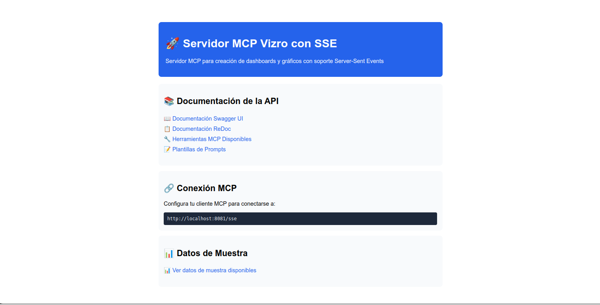
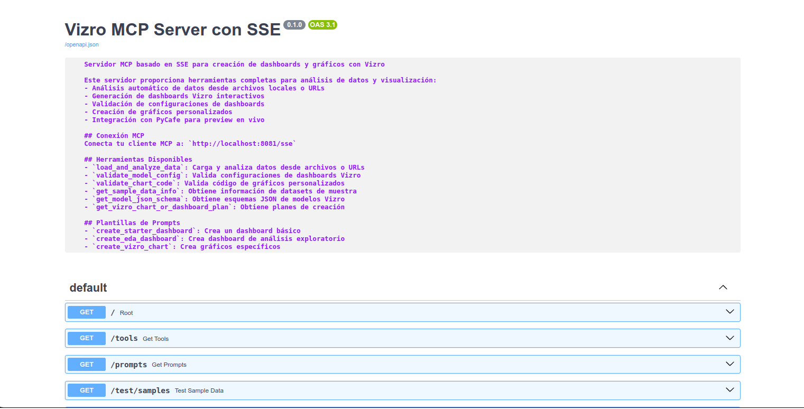
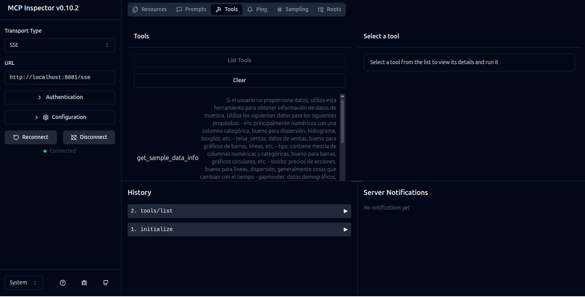

# Servidor MCP dashboard SSE y Vizro



MCP-Dashboard es un servidor de [Protocolo de Contexto de Modelo (MCP)](https://modelcontextprotocol.io/), que funciona junto con un LLM para ayudarte a crear dashboards y gráficos de Vizro.


## Características de MCP-Dashboard

MCP-Dashboard proporciona herramientas y plantillas para crear un gráfico o dashboard de Vizro funcional paso a paso. Los beneficios incluyen:

✅ Un marco de trabajo consistente para gráficos y dashboards con un lenguaje de diseño común.

✅ Salida de configuración validada que es legible y fácil de alterar o mantener.

✅ Vista previa en vivo del dashboard para iterar el diseño hasta que sea perfecto.

✅ Uso de conjuntos de datos locales o remotos simplemente proporcionando una ruta o URL.

### Sin MCP-Dashboard

Sin MCP-Dashboard, si intentas crear un dashboard usando un LLM, podría elegir cualquier framework y usarlo sin una guía específica, principios de diseño o consistencia. Los resultados son:

❎ Una elección aleatoria de framework de frontend o biblioteca de gráficos.

❎ Un desorden codificado "a sentimiento" que puede o no funcionar, pero que ciertamente no es muy mantenible.

❎ No hay forma de previsualizar fácilmente el dashboard.

❎ No hay una forma sencilla de conectarse a datos reales.

## 🛠️ Empezando

MCP-Dashboard se puede ejecutar de dos maneras: usando [`uvx`](https://docs.astral.sh/uv/guides/tools/) o usando [`Docker`](https://www.docker.com/get-started/). Funciona con cualquier cliente LLM habilitado para MCP, como Windsurf, Cursor o Claude Desktop.

Si quieres ejecutar MCP-Dashboard directamente desde el código fuente, salta al final de esta página a [Desarrollo o ejecución desde el código fuente](#desarrollo-o-ejecución-desde-el-código-fuente).

### Prerrequisitos

- [uv](https://docs.astral.sh/uv/getting-started/installation/) **o** [Docker](https://www.docker.com/get-started/)
- Cualquier aplicación LLM que soporte MCP, como [Claude Desktop](https://claude.ai/download) , [Cursor](https://www.cursor.com/downloads) o [WindSurf](https://windsurf.com/download)

### Instrucciones de Configuración

La configuración general del servidor es prácticamente la misma para todos los hosts:

#### 1. Configuración

**Usando `npx`**

```json
{
  "mcpServers": {
    "mcp_server_dashboards_sse": {
      "command": "npx",
      "args": [
        "-y",
        "supergateway",
        "--sse",
        "http://localhost:8081/sse"
      ],
      "disabled": false
    }
  }
}
```

**Usando `Docker`**

```json
{
  "mcpServers": {
    "MCP-Dashboard": {
      "command": "docker",
      "args": [
        "run",
        "-i",
        "--rm",
        "--mount",
        "type=bind,src=</ruta/absoluta/a/directorio/permitido>,dst=</ruta/absoluta/a/directorio/permitido>",
        "--mount",
        "type=bind,src=</ruta/absoluta/a/datos.csv>,dst=</ruta/absoluta/a/datos.csv>",
        "mcp/vizro"
      ]
    }
  }
}
```

> Para usar datos locales con MCP-Dashboard, monta tu directorio o directorios de datos en el contenedor. Reemplaza `</ruta/absoluta/a/directorio/permitido>` (sintaxis para carpetas) o `</ruta/absoluta/a/datos.csv>` (sintaxis para archivos) con la ruta absoluta a tus datos en tu máquina. Por consistencia, se recomienda que la ruta `dst` coincida con la ruta `src`.

#### 2. Añade la Configuración a las aplicaciones LLM habilitadas para MCP

En principio, el servidor MCP Dashboard con Vizro funciona con _cualquier_ aplicación LLM habilitada para MCP, pero recomendamos Claude Desktop o Cursor como opciones populares (ver instrucciones más detalladas a continuación). Diferentes herramientas de IA pueden usar diferentes métodos de configuración o ajustes de conexión. Consulta la documentación de cada herramienta para más detalles.

<details>
<summary><strong>Claude Desktop</strong></summary>

- Añade la configuración a tu `claude_desktop_config.json` ([se encuentra a través de la Configuración de Desarrollador](https://modelcontextprotocol.io/quickstart/user#2-add-the-filesystem-mcp-server)).

- Reinicia Claude Desktop. Después de unos momentos, deberías ver el menú de MCP-Dashboard en el menú de configuración/contexto:

    

> ⚠️ **Advertencia:** En algunos hosts (como Claude Desktop) el plan gratuito puede tener un rendimiento inferior, lo que puede causar problemas cuando la solicitud es demasiado compleja. En los casos en que la solicitud provoque que la interfaz de usuario se bloquee, opta por usar un plan de pago o reduce la complejidad de tu solicitud.

</details>

<details>
<summary><strong>WindSurf</strong></summary>

- Añade la configuración anterior a tu `mcp.json` ([ver Configuración de WindSurf](https://www.google.com/url?sa=t&rct=j&q=&esrc=s&source=web&cd=&ved=2ahUKEwj_o8vqkfuNAxU2SDABHfZVLrsQFnoECBkQAQ&url=https%3A%2F%2Fdocs.windsurf.com%2Fwindsurf%2Fcascade%2Fmcp&usg=AOvVaw3KcLhdmTkkdZGOxPSZ0oXK&opi=89978449)).

- Después de una breve pausa, deberías ver una luz verde en el menú de MCP , sino lo peudes ver recargar el IDE:

    

</details>
<details>
<summary><strong>Cursor</strong></summary>

- Añade la configuración anterior a tu `mcp.json` ([ver Configuración de Cursor](https://docs.cursor.com/context/model-context-protocol#configuration-locations)).

- Después de una breve pausa, deberías ver una luz verde en el menú de MCP, sino lo peudes ver recargar el IDE:

    

</details>
<details>
<summary><strong>Otros Clientes MCP</strong></summary>

- Añade la configuración según la documentación de tu cliente.

- Consulta la documentación de tu cliente para saber dónde colocar la configuración y cómo verificar que el servidor se está ejecutando.

</details>

## 💻 Uso

### Usa plantillas de prompts para obtener dashboards específicos rápidamente

Las plantillas de prompts no están disponibles en todos los hosts de MCP, pero cuando lo están, puedes usarlas para obtener dashboards específicos rápidamente. Para acceder a ellas (por ejemplo, en Claude Desktop), haz clic en el icono de más debajo del chat y elige _`Añadir desde MCP-Dashboard`_.


La forma **más fácil** de empezar con los dashboards de Vizro es elegir la plantilla `create_starter_dashboard` y simplemente enviar el prompt. Esto creará un dashboard súper simple con una página, un gráfico y un filtro. ¡A partir de ahí, puedes seguir tú!

### Crea un dashboard con Vizro basado en datos locales o remotos

También puedes pedirle al LLM que cree dashboards específicos basados en datos locales o remotos si ya tienes una idea de lo que quieres. Ejemplos de prompts podrían ser:

> _Crea un dashboard de Vizro con una página, un gráfico de dispersión y un filtro basado en los datos de `<inserta ruta de archivo absoluta o URL pública>`._

> _Crea un dashboard de Vizro simple de dos páginas, donde la primera página sea un análisis de correlación de los datos de `<inserta ruta de archivo absoluta o URL pública>`, y la segunda página sea un gráfico de mapa de los datos de `<inserta ruta de archivo absoluta o URL pública>`_

Puedes encontrar un conjunto de CSVs de muestra para probar en el [repositorio de Plotly](https://github.com/plotly/datasets/tree/master).

Incluso puedes pedir un dashboard sin proporcionar datos:

> _Crea un dashboard de Vizro con una página, un gráfico de dispersión y un filtro._

En general, ayuda especificar Vizro en el prompt y mantenerlo lo más preciso (y simple) posible.

### Obtén una vista previa en vivo de tu dashboard

Cuando el LLM elige usar la herramienta `validate_model_config`, y la herramienta se ejecuta con éxito, el LLM devolverá un enlace a una vista previa en vivo del dashboard si solo se utilizan datos públicos a los que se accede a través de una URL. Por defecto, el LLM incluso abrirá el enlace en tu navegador por ti, a menos que le digas que no lo haga. En Claude Desktop, puedes ver la salida de la herramienta abriendo el desplegable de la herramienta y desplazándote hasta el final.


También puedes pedirle al modelo que te dé el enlace, pero intentará regenerarlo, lo cual es muy propenso a errores y lento.

### Crea gráficos de Vizro

Si no quieres crear un dashboard de Vizro completo, aún puedes usar MCP-Dashboard para crear el código para un solo gráfico. Si no estás seguro de qué tipo de gráfico quieres, echa un vistazo al [Vocabulario Visual de Vizro](https://huggingface.co/spaces/vizro/demo-visual-vocabulary) para obtener ideas.

La forma **más fácil** de crear un gráfico de Vizro es elegir la plantilla `create_vizro_chart` y simplemente enviar el prompt. Esto creará un gráfico simple que puedes modificar. ¡A partir de ahí, puedes seguir tú!

Alternativamente, puedes simplemente pedirlo en el chat, por ejemplo:

> _Crea un gráfico de dispersión basado en el conjunto de datos iris._

> _Crea un gráfico de barras basado en los datos de `<inserta ruta de archivo absoluta o URL pública>`._

## 🔍 Transparencia y confianza

Los servidores MCP son un concepto relativamente nuevo, y es importante ser transparente sobre lo que las herramientas son capaces de hacer para que puedas tomar una decisión informada como usuario. En general, el servidor MCP Dashboard con Vizro solo lee datos, y nunca escribe, elimina o modifica ningún dato en tu máquina.

En general, la parte más crítica del proceso es la herramienta `load_and_analyze_data`. Esta herramienta, que se ejecuta en tu máquina, cargará datos locales o remotos en un DataFrame de pandas y proporcionará un análisis detallado de su estructura y contenido. Solo usa `pd.read_xxx`, por lo que en general no hay necesidad de preocuparse por la privacidad o la seguridad de los datos.

La segunda parte más crítica es la herramienta `validate_model_config`. Esta herramienta intentará instanciar la configuración del modelo de Vizro y devolverá el código Python y el enlace de visualización para configuraciones válidas. Si la configuración es válida, también devolverá e intentará abrir un enlace a una vista previa en vivo del dashboard, que te llevará a [PyCafe](https://py.cafe). Si no quieres abrir el enlace, puedes decirle al LLM que no lo haga.

## Herramientas Disponibles (si el cliente lo permite)

El servidor MCP Dashboard con Vizro proporciona las siguientes herramientas. En general, no deberías necesitar usarlas directamente, pero en casos especiales podrías pedirle al LLM que las llame directamente para ayudarlo a orientarse.

- `get_vizro_chart_or_dashboard_plan` - Obtiene un plan estructurado paso a paso para crear un gráfico o un dashboard. Proporciona una guía sobre todo el proceso de creación.
- `get_model_json_schema` - Recupera el esquema JSON completo para cualquier modelo de Vizro especificado, útil para comprender los parámetros requeridos y opcionales.
- `validate_model_config` - Prueba las configuraciones del modelo de Vizro intentando instanciarlas. Devuelve el código Python y los enlaces de visualización para configuraciones válidas.
- `load_and_analyze_data` - Carga un archivo CSV desde una ruta local o URL en un DataFrame de pandas y proporciona un análisis detallado de su estructura y contenido.
- `validate_chart_code` - Valida el código creado para un gráfico y devuelve comentarios sobre su corrección.
- `get_sample_data_info` - Proporciona información sobre conjuntos de datos de muestra que se pueden utilizar para pruebas y desarrollo.

## Prompts Disponibles (si el cliente lo permite)

- `create_starter_dashboard` - Usa esta plantilla de prompt para empezar con los dashboards de Vizro.
- `create_EDA_dashboard` - Usa esta plantilla de prompt para crear un dashboard de Análisis Exploratorio de Datos (EDA) basado en un conjunto de datos CSV local o remoto.
- `create_vizro_chart` - Usa esta plantilla de prompt para crear un gráfico de plotly con estilo Vizro basado en un conjunto de datos CSV local o remoto.

## Desarrollo o ejecución desde el código fuente

Si eres un desarrollador, o si estás ejecutando MCP-Dashboard desde el código fuente, necesitas clonar el repositorio. Para configurar los detalles del servidor MCP-Dashboard:

Añade lo siguiente a tu configuración de MCP:

```json
{
  "mcpServers": {
    "MCP-Dashboard": {
      "command": "uv",
      "args": [
        "run",
        "--directory",
        "<RUTA>/MCP_Dashboard/",
        "server.py"
      ]
    }
  }
}
```

Reemplaza `<RUTA>` con la ruta real a tu repositorio. También es posible que necesites proporcionar la ruta completa a tu ejecutable `uv`, por lo que en lugar de `"uv"` usarías algo como `"/Users/<tu-nombre-de-usuario>/.local/bin/uv"`. Para descubrir la ruta de `uv` en tu máquina, en tu aplicación de terminal, escribe `which uv`.

## 📖 Documentación

La documentación de la API está disponible en dos formatos:

- Swagger UI: http://localhost:8081/docs
  

- ReDoc: http://localhost:8081/redoc
  

## 🔍 Pruebas con MCP Inspector

Para verificar el funcionamiento del servidor, puedes utilizar MCP Inspector:

```bash
# Verificar instalación de Node.js
node --version

# Ejecutar MCP Inspector
npx -y @modelcontextprotocol/inspector
```

Esto abrirá el MCP Inspector en http://127.0.0.1:6274:



## 📚 Dependencias

Las principales dependencias del proyecto son:

- fastapi: Framework web para crear APIs y documentación
- fastmcp: Implementación del protocolo MCP
- httpx: Cliente HTTP asíncrono
- uvicorn: Servidor ASGI para FastAPI
- pydantic: Validación de datos
- vizro: Biblioteca principal para la creación de dashboards y gráficos interactivos

Para ver la lista completa, consulta el archivo `pyproject.toml`.

## Descargos de responsabilidad

<details>
<summary><strong>API de terceros</strong></summary>

Los usuarios son responsables de todo lo que se haga a través de su aplicación LLM anfitriona.

Los usuarios son responsables de obtener todos los derechos necesarios para acceder a cualquier herramienta de IA generativa de terceros y de cumplir con los términos o condiciones aplicables de las mismas.

Los usuarios son totalmente responsables del uso y la seguridad de las herramientas de IA generativa de terceros y de MCP-Dashboard.

</details>

<details>
<summary><strong>Reconocimientos del usuario</strong></summary>

Los usuarios reconocen y aceptan que:

Cualquier resultado, opción, dato, recomendación, análisis, código u otra información ("Salidas") generada por cualquier herramienta de IA generativa de terceros ("Herramientas GenAI") puede contener algunas inexactitudes, sesgos, contenido ilegítimo, potencialmente infractor o de otro modo inapropiado que puede ser erróneo, discriminatorio o engañoso.

Los autores del proyecto:

(i) renuncian expresamente a la exactitud, adecuación, puntualidad, fiabilidad, comerciabilidad, idoneidad para un propósito particular, no infracción, seguridad o integridad de cualquier Salida,

(ii) no será responsable de ningún error, omisión u otros defectos, retrasos o interrupciones en dichas Salidas, ni de ninguna acción tomada en base a ellas, y

(iii) no será responsable de ninguna presunta violación o infracción de ningún derecho de terceros resultante del uso por parte de los usuarios de las Herramientas GenAI y las Salidas.

Las Salidas deberán ser verificadas y validadas por los usuarios y no deberán utilizarse sin supervisión humana y como única base para tomar decisiones que afecten a las personas.

Los usuarios siguen siendo los únicos responsables del uso de la Salida, en particular, los usuarios deberán determinar el nivel de supervisión humana necesario dado el contexto y el caso de uso, así como de informar al personal de los usuarios y a otros usuarios afectados sobre la naturaleza de la Salida de GenAI. Los usuarios también son totalmente responsables de sus decisiones, acciones, uso de Vizro y MCP-Dashboard y del cumplimiento de las leyes, normas y reglamentos aplicables, incluyendo, entre otros, la confirmación de que las Salidas no infringen ningún derecho de terceros.

</details>

<details>
<summary><strong>Advertencia y uso seguro para modelos de IA generativa</strong></summary>

MCP-Dashboard es utilizado por modelos de IA generativa porque los grandes modelos de lenguaje (LLM) representan avances significativos en el campo de la IA. Sin embargo, como con cualquier herramienta poderosa, existen riesgos potenciales asociados con la conexión a un modelo de IA generativa.

Recomendamos a los usuarios que investiguen y comprendan el modelo seleccionado antes de usar MCP-Dashboard.

Se anima a los usuarios a tratar el contenido generado por IA como complementario, aplicar siempre el juicio humano, abordar con precaución, revisar la página de descargo de responsabilidad pertinente y considerar lo siguiente:

<ol>
<li>Alucinación y tergiversación</li>
Los modelos generativos pueden generar información que, aunque parezca factual, sea completamente ficticia o engañosa.

Los modelos de los proveedores pueden carecer de conocimiento en tiempo real o de eventos posteriores a sus últimas actualizaciones. La salida de MCP-Dashboard puede variar y siempre se debe verificar la información crítica. Es responsabilidad del usuario discernir la exactitud, consistencia y fiabilidad del contenido generado.

<li>Salida no intencionada y sensible</li>
Las salidas de estos modelos pueden ser inesperadas, inapropiadas o incluso dañinas. La intervención humana es una parte esencial. Los usuarios deben verificar e interpretar la salida final. Es necesario abordar el contenido generado con precaución, especialmente cuando se comparte o aplica en diversos contextos.

<li>Privacidad de los datos</li>
Sus datos se envían a los proveedores de modelos si se conecta a los LLM a través de sus API. Por ejemplo, si se conecta al modelo de OpenAI, sus datos se enviarán a OpenAI a través de su API. Los usuarios deben ser cautelosos al compartir o introducir cualquier información personal o sensible.

<li>Sesgo y equidad</li>
La IA generativa puede exhibir los sesgos presentes en sus datos de entrenamiento. Los usuarios deben ser conscientes y navegar por los posibles sesgos en las salidas generadas y ser cautelosos al interpretar el contenido generado.

<li>Uso malicioso</li>
Estos modelos pueden ser explotados para diversas actividades maliciosas. Los usuarios deben ser cautelosos sobre cómo y dónde despliegan y acceden a dichos modelos.
</ol>
Es crucial que los usuarios se mantengan informados, cautelosos y éticos en sus aplicaciones.

</details>
