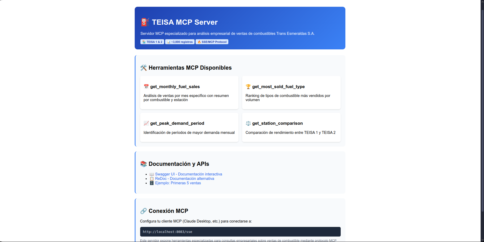
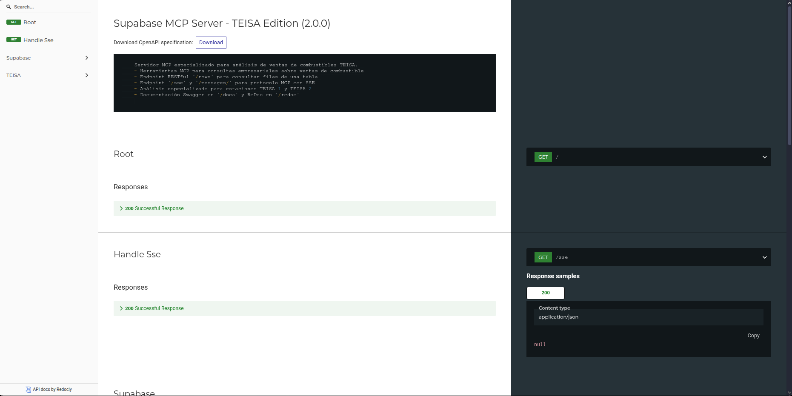

# Servidor MCP Supabase TEISA



Un servidor Model Context Protocol (MCP) especializado para análisis empresarial de ventas de combustibles Trans Esmeraldas S.A. (TEISA), con soporte para consultas avanzadas mediante SSE y REST API documentada.

## 📋 Índice
- [Características](#características)
- [Requisitos previos](#requisitos-previos)
- [Instalación y ejecución local](#instalación-y-ejecución-local)
- [Integración con clientes MCP](#integración-con-clientes-mcp)
- [Herramientas MCP disponibles](#herramientas-mcp-disponibles)
- [Endpoints REST y documentación](#endpoints-rest-y-documentación)
- [Variables de entorno](#variables-de-entorno)
- [Docker](#docker)
- [Notas importantes](#notas-importantes)
- [Dependencias](#dependencias)

## ✨ Características

- **Análisis especializado TEISA**: Herramientas MCP diseñadas específicamente para ventas de combustibles de las estaciones TEISA 1 y TEISA 2
- **Protocolo MCP completo**: Server-Sent Events (SSE) para integración con asistentes de IA
- **API REST documentada**: Endpoints RESTful con documentación Swagger UI y ReDoc
- **Consultas empresariales avanzadas**: Análisis de demanda, comparación de estaciones, ranking de combustibles
- **Gestión de ~3,000 registros**: Procesamiento eficiente de grandes volúmenes de datos de ventas
- **Docker-ready**: Imagen lista para despliegue en producción

## 🔧 Requisitos previos

- Python 3.13 o superior
- [uv](https://github.com/astral-sh/uv) (gestor de paquetes y entornos virtuales)
- Cuenta y proyecto activo en Supabase
- Variables de entorno: `SUPABASE_URL` y `SUPABASE_SERVICE_KEY`

## 🚀 Instalación y ejecución local

### 1. Instalar uv (Gestor de entornos para Python)

```bash
# En macOS/Linux
curl -LsSf https://astral.sh/uv/install.sh | sh

# Verificar la instalación
uv --version
```

### 2. Clonar y configurar el proyecto

```bash
# Clonar el repositorio
git clone https://github.com/snayderstone/mcp_supabase.git

# Acceder al repositorio
cd mcp_supabase

# Crear entorno virtual
uv venv .venv

# Activar entorno virtual
source .venv/bin/activate

# Instalar dependencias
uv sync
```

### 3. Configurar variables de entorno

```bash
# Crear archivo .env (nunca incluir en git)
echo "SUPABASE_URL=tu_url_de_supabase" > .env
echo "SUPABASE_SERVICE_KEY=tu_clave_de_servicio" >> .env

# O exportar directamente
export SUPABASE_URL="tu_url_de_supabase"
export SUPABASE_SERVICE_KEY="tu_clave_de_servicio"
```

### 4. Ejecutar el servidor

```bash
# Ejecutar con SSE para protocolo MCP
uv run server.py

# O ejecutar con API REST completa
uv run server.py --api
```

Tras la ejecución, verás los siguientes mensajes:
```
🚀 Iniciando TEISA Supabase MCP Server...
📡 Servidor disponible en: http://0.0.0.0:8083
🔗 Endpoint MCP SSE: http://0.0.0.0:8083/sse
📚 Documentación: http://0.0.0.0:8083/docs
⛽ Herramientas TEISA: 5 herramientas especializadas cargadas
```

## 🔌 Integración con clientes MCP

### Con Claude Desktop

Para utilizar este servidor con Claude Desktop, añade la siguiente configuración al archivo `claude_desktop_config.json`:

```json
{
  "mcpServers": {
    "supabase-teisa": {
      "command": "npx",
      "args": [
        "-y",
        "supergateway",
        "--sse",
        "http://localhost:8083/sse"
      ],
      "disabled": false,
      "autoApprove": []
    }
  }
}
```

### Con el cliente MCP Visual Studio Code

1. **Instalar la extensión MCP** para VS Code desde el marketplace
2. **Crear la estructura de configuración**:
   ```bash
   # Crear carpeta .vscode en la raíz de tu proyecto
   mkdir .vscode
   
   # Crear archivo de configuración MCP
   touch .vscode/mcp.json
   ```

3. **Configurar el archivo** `.vscode/mcp.json`:
   ```json
   {
       "servers": {
           "mcp_supabase_teisa": { 
               "url": "http://localhost:8083/sse"
           }
       }
   }
   ```

4. **Activar el servidor MCP**:
   - Abre VS Code en tu proyecto
   - Presiona `Ctrl+Shift+P` (o `Cmd+Shift+P` en Mac)
   - Busca "MCP: Connect to Server"
   - Selecciona `mcp_supabase_teisa` de la lista
   - El servidor aparecerá conectado en la barra de estado

## 🛠️ Herramientas MCP disponibles

### 1. `get_table_rows`
**Descripción**: Obtiene filas de cualquier tabla Supabase
**Parámetros**:
- `table` (string, requerido): Nombre de la tabla
- `limit` (int, opcional): Límite de filas (default: 10)

**Ejemplo**:
```json
{
  "table": "tbl_ventas_teisa",
  "limit": 5
}
```

### 2. `get_monthly_fuel_sales`
**Descripción**: Análisis de ventas por mes específico con resumen por combustible y estación
**Parámetros**:
- `year` (int, requerido): Año de consulta (ej: 2024)
- `month` (int, requerido): Mes de consulta (1-12)

**Ejemplo**:
```json
{
  "year": 2024,
  "month": 3
}
```

### 3. `get_most_sold_fuel_type`
**Descripción**: Ranking de tipos de combustible más vendidos por volumen
**Parámetros**: Ninguno

**Ejemplo de respuesta**:
```json
{
  "combustible_mas_vendido": "Gasolina Extra",
  "ranking_por_litros": [
    {
      "tipo_combustible": "Gasolina Extra",
      "litros_totales": 45230.50,
      "numero_ventas": 1205,
      "monto_total": 85420.30
    }
  ]
}
```

### 4. `get_peak_demand_period`
**Descripción**: Identificación de períodos de mayor demanda mensual
**Parámetros**: Ninguno

### 5. `get_station_comparison`
**Descripción**: Comparación de rendimiento entre TEISA 1 y TEISA 2
**Parámetros**: Ninguno

## 📖 Endpoints REST y documentación

La documentación de la API está disponible en dos formatos:

- **Swagger UI**: http://localhost:8083/docs
   
- **ReDoc**: http://localhost:8083/redoc
    

- **Página principal**: http://localhost:8083 (panel de control interactivo)

### Ejemplo de consulta REST

```http
GET /rows?table=tbl_ventas_teisa&limit=5
```

**Respuesta**:
```json
[
  {
    "id": 1,
    "Fecha": "03-15-2024",
    "Estación": "TEISA 1",
    "Tipo_Combustible": "Gasolina Extra",
    "Litros_Vendidos": 45.50,
    "Total_Venta": 85.30
  }
]
```
## 🔑 Variables de entorno

| Variable | Descripción | Ejemplo |
|----------|-------------|---------|
| `SUPABASE_URL` | URL de tu proyecto Supabase | `https://tu-proyecto.supabase.co` |
| `SUPABASE_SERVICE_KEY` | Service role key de Supabase | `eyJhbGciOiJIUzI1NiIsInR5cCI6IkpXVCJ9...` |

## 🔍 Pruebas con MCP Inspector

Para verificar el funcionamiento del servidor, puedes utilizar MCP Inspector:

```bash
# Verificar instalación de Node.js
node --version

# Ejecutar MCP Inspector
npx -y @modelcontextprotocol/inspector
```

Esto abrirá el MCP Inspector en http://127.0.0.1:6274:


## ⚠️ Notas importantes

### Formato de fechas
> **IMPORTANTE**: Si tu columna `Fecha` en Supabase está en formato `MM-DD-YYYY` (mes-día-año), la herramienta `get_monthly_fuel_sales` ya está adaptada para comparar correctamente usando ese formato. Si cambias el formato de la columna a `YYYY-MM-DD`, deberás ajustar la función para que las fechas de consulta coincidan con ese nuevo formato.

### Seguridad
- Nunca incluyas las variables de entorno en el control de versiones
- Usa siempre la `SERVICE_KEY` y no la `ANON_KEY` para operaciones del servidor
- Mantén actualizadas las dependencias del proyecto

### Rendimiento
- El servidor está optimizado para procesar ~3,000 registros de ventas
- Usa paginación para consultas grandes mediante el parámetro `limit`
- Las consultas especializadas incluyen agregaciones para mejorar el rendimiento

## 📚 Dependencias

Las principales dependencias del proyecto son:

- **fastapi** (≥0.115.14): Framework web para crear APIs y documentación
- **mcp[cli]** (≥1.10.1): Implementación del protocolo MCP
- **supabase** (≥2.16.0): Cliente oficial de Supabase para Python
- **httpx** (≥0.28.1): Cliente HTTP asíncrono
- **pandas** (≥2.3.0): Manipulación y análisis de datos
- **uvicorn**: Servidor ASGI para FastAPI

Para ver la lista completa de dependencias, consulta el archivo `pyproject.toml`.

## 🤝 Contribución

1. Fork el proyecto
2. Crea una rama para tu feature (`git checkout -b feature/nueva-funcionalidad`)
3. Commit tus cambios (`git commit -am 'Añadir nueva funcionalidad'`)
4. Push a la rama (`git push origin feature/nueva-funcionalidad`)
5. Abre un Pull Request

## 📄 Licencia

Este proyecto está bajo la Licencia MIT. Ver el archivo `LICENSE` para más detalles.