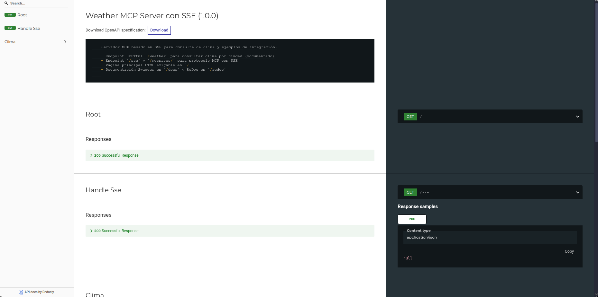
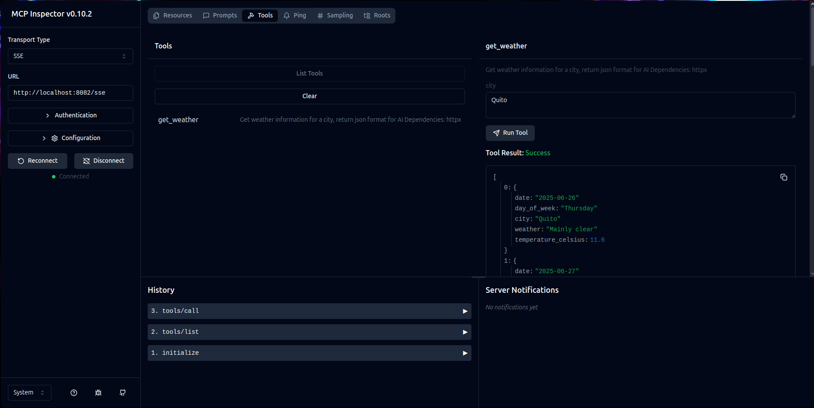

# Servidor MCP del Clima


Un servidor Model Context Protocol (MCP) que proporciona información meteorológica actualizada para cualquier ciudad utilizando la API de Open-Meteo.

## 📋 Índice
- [Características](#características)
- [Requisitos previos](#requisitos-previos)
- [Instalación y ejecución local](#instalación-y-ejecución-local)
- [Integración con clientes MCP](#integración-con-clientes-mcp)
- [Uso de la API](#uso-de-la-api)
- [Documentación](#documentación)
- [Docker](#docker)
- [Pruebas con MCP Inspector](#pruebas-con-mcp-inspector)
- [Dependencias](#dependencias)

## ✨ Características

- Obtiene información meteorológica actualizada para cualquier ciudad del mundo
- Proporciona datos como temperatura, condición climática y pronóstico diario
- Implementa el estándar Model Context Protocol (MCP) para integración con LLMs
- Incluye servidor SSE (Server-Sent Events) para comunicaciones en tiempo real
- Documentación API completa con Swagger UI y ReDoc
- Fácil de ejecutar localmente o en Docker

## 🔧 Requisitos previos

- Python 3.13 o superior
- [uv](https://github.com/astral-sh/uv) (gestor de paquetes y entornos virtuales)
- Node.js (solo para pruebas con MCP Inspector)

## 🚀 Instalación y ejecución local

### 1. Instalar uv (Gestor de entornos para Python)

```bash
# En macOS/Linux
curl -LsSf https://astral.sh/uv/install.sh | sh

# Verificar la instalación
uv --version
```

### 2. Clonar y configurar el proyecto

```bash
# Clonar el repositorio
git clone https://github.com/snayderstone/mcp_weather.git

# Acceder al repositorio
cd mcp_weather

# Crear entorno virtual
uv venv .venv

# Activar entorno virtual
source .venv/bin/activate

# Instalar dependencias
uv sync
```

### 3. Ejecutar el servidor

```bash
uv run server.py
```

Tras la ejecución, verás los siguientes mensajes:
```
🚀 Iniciando Weather MCP Server con soporte SSE...
📡 Servidor disponible en: http://0.0.0.0:8082
🔗 Endpoint MCP SSE: http://0.0.0.0:8082/sse
📚 Documentación: http://0.0.0.0:8082/docs
```

## 🔌 Integración con clientes MCP

Para utilizar este servidor con un cliente compatible con el protocolo MCP, añade la siguiente configuración al archivo `cliente_mcp_settings.json`:

```json
{
  "mcpServers": {
    "weather": {
      "command": "npx",
      "args": [
        "-y",
        "supergateway",
        "--sse",
        "http://localhost:8082/sse"
      ],
      "disabled": false,
      "autoApprove": []
    }
  }
}
```
### Con el cliente MCP Visual Studio Code

1. **Instalar la extensión MCP** para VS Code desde el marketplace
2. **Crear la estructura de configuración**:
   ```bash
   # Crear carpeta .vscode en la raíz de tu proyecto
   mkdir .vscode
   
   # Crear archivo de configuración MCP
   touch .vscode/mcp.json
   ```

3. **Configurar el archivo** `.vscode/mcp.json`:
   ```json
   {
       "servers": {
           "mcp_server_weather": { 
               "url": "http://localhost:8082/sse"
           }
       }
   }
   ```

4. **Activar el servidor MCP**:
   - Abre VS Code en tu proyecto
   - Presiona `Ctrl+Shift+P` (o `Cmd+Shift+P` en Mac)
   - Busca "MCP: Connect to Server"
   - Selecciona `mcp_server_weather` de la lista
   - El servidor aparecerá conectado en la barra de estado

5. **Usar la herramienta**:
   - Abre cualquier archivo en VS Code
   - Presiona `Ctrl+Shift+P` y busca "MCP: Use Tool"
   - Selecciona `get_weather` y proporciona el nombre de una ciudad

## 🌡️ Uso de la Herramienta

Este servidor expone una única herramienta `get_weather` que proporciona información meteorológica completa.

### Herramienta: `get_weather`

**Parámetros:**
- `city` (cadena, requerido): Nombre de la ciudad

**Ejemplo de uso en un cliente MCP:**

```
<use_mcp_tool>
<server_name>weather</server_name>
<tool_name>get_weather</tool_name>
<arguments>
{
  "city": "Quito"
}
</arguments>
</use_mcp_tool>
```

**Respuesta:**
```json
[
  {
    "date": "2025-07-03",
    "day_of_week": "Thursday",
    "city": "Quito",
    "weather": "Partly cloudy",
    "temperature_celsius": 15.2
  },
  ...
]
```

## 📖 Documentación

La documentación de la API está disponible en dos formatos:

- Swagger UI: http://localhost:8082/docs
  

- ReDoc: http://localhost:8082/redoc
  


## 🔍 Pruebas con MCP Inspector

Para verificar el funcionamiento del servidor, puedes utilizar MCP Inspector:

```bash
# Verificar instalación de Node.js
node --version

# Ejecutar MCP Inspector
npx -y @modelcontextprotocol/inspector
```

Esto abrirá el MCP Inspector en http://127.0.0.1:6274:



## 📚 Dependencias

Las principales dependencias del proyecto son:

- fastapi: Framework web para crear APIs y documentación
- fastmcp: Implementación del protocolo MCP
- httpx: Cliente HTTP asíncrono
- uvicorn: Servidor ASGI para FastAPI
- pydantic: Validación de datos

Para ver la lista completa, consulta el archivo `pyproject.toml`.

