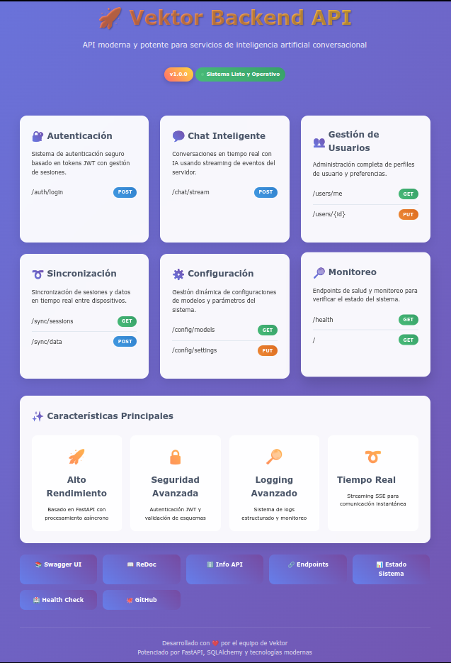

# Vektor Backend

<div align="center">
  
  <h3>API Moderna de Agente IA con Streaming Multi-Servidor</h3>
  <p>Backend FastAPI con SSE, Integración MCP y Monitoreo Avanzado</p>
</div>

## 🚀 Descripción General

Vektor Backend es una robusta API basada en FastAPI que impulsa la plataforma de asistente IA Vektor. Ofrece chat en streaming en tiempo real a través de Server-Sent Events (SSE), soporta el Protocolo de Control de Modelos (MCP) para capacidades de IA mejoradas, y proporciona un sistema completo de autenticación.

<div align="center">
  
  <p><em>Estructura del Directorio Raíz del Backend</em></p>
</div>

## ✨ Características Principales

- **🚀 Streaming en Tiempo Real**: Chat streaming basado en SSE para respuestas instantáneas
- **🧩 Integración MCP**: Soporte para múltiples servidores de Protocolo de Control de Modelos
- **🔐 Autenticación JWT**: Gestión segura de usuarios basada en tokens
- **📊 Monitoreo Avanzado**: Verificaciones de salud incorporadas y paneles de estado del sistema
- **🔄 Sincronización**: Sincronización de sesiones y datos entre múltiples dispositivos
- **⚡ Alto Rendimiento**: Manejo asíncrono de solicitudes con FastAPI
- **📝 Registro Detallado**: Logs estructurados con rotación y compresión

## 🛠️ Stack Tecnológico

- **Framework**: FastAPI
- **Base de Datos**: PostgreSQL + SQLAlchemy (ORM asíncrono)
- **Migraciones**: Alembic
- **Autenticación**: Tokens JWT
- **Despliegue**: Uvicorn y Gunicorn
- **Registro**: Loguru con formatos estructurados
- **Documentación API**: Swagger y ReDoc generados automáticamente

## 📋 Prerrequisitos

- Python ≥ 3.12
- PostgreSQL
- Gestor de paquetes [uv](https://docs.astral.sh/uv/getting-started/installation/)

## 🔧 Instalación

1. **Clonar el repositorio y navegar al directorio del backend**:
   ```bash
   git clone https://github.com/Snayderstone/Vektor
   cd Vektor/backend
   ```

2. **Configurar el entorno**:
   ```bash
   cp .env.example .env
   # Editar .env con sus credenciales de base de datos y otras configuraciones
   ```

3. **Instalar dependencias**:
   ```bash
   uv sync
   ```

4. **Inicializar la configuración y la base de datos**:
   ```bash
   uv run scripts/init_config.py
   uv run scripts/init_db.py
   ```

5. **Crear usuario administrador**:
   ```bash
   uv run scripts/startup.py --user --email <email> --username <nombre> --password <contraseña>
   ```

6. **Ejecutar el servidor**:
   ```bash
   # Modo desarrollo
   python main.py
   
   # Modo producción con Gunicorn
   python main.py prod
   ```

## 🌐 Configuración

### Variables de Entorno (.env)

| Clave                | Descripción                             | Valor Predeterminado |
|----------------------|-----------------------------------------|----------------------|
| `DATABASE_URL`       | URL de conexión PostgreSQL              | *requerido*          |
| `BACKEND_CORS_ORIGINS` | Orígenes CORS permitidos              | []                   |
| `SECRET_KEY`         | Clave secreta JWT                       | *requerido*          |
| `ACCESS_TOKEN_EXPIRE_MINUTES` | Expiración de token JWT        | 60                   |
| `REFRESH_TOKEN_EXPIRE_DAYS` | Expiración token de actualización| 30                   |
| `LOG_LEVEL`          | Nivel de registro (INFO, DEBUG, etc.)   | INFO                 |
| `LOG_FORMAT`         | Formato de log (estructurado, simple)   | structured           |

### Archivos de Configuración

El backend utiliza archivos JSON en `config/` para definir modelos, servidores MCP y adaptadores:

- **`model_configs.json`**: Define los modelos LLM disponibles
- **`mcp_servers.json`**: Especifica endpoints y configuraciones de servidores MCP
- **`app/*.json`**: Definiciones personalizadas de adaptadores para diferentes servicios

## 🚪 Endpoints de API

<div align="center">
  
  <p><em>Documentación Interactiva de API</em></p>
</div>

### Autenticación
- `POST /auth/login`: Autenticarse y obtener token JWT
- `POST /auth/register`: Crear una nueva cuenta de usuario
- `POST /auth/refresh`: Actualizar un token expirado
- `POST /auth/logout`: Invalidar token actual

### Chat
- `POST /chat/stream`: Streaming de chat en tiempo real vía SSE
- `GET /chat/history`: Obtener historial de conversaciones
- `GET /chat/history/{conversation_id}`: Obtener conversación específica
- `DELETE /chat/history/{conversation_id}`: Eliminar conversación
- `GET /chat/models`: Listar modelos disponibles

### Usuarios
- `GET /users/me`: Obtener perfil del usuario actual
- `PUT /users/me`: Actualizar perfil de usuario
- `DELETE /users/me`: Eliminar cuenta de usuario
- `POST /users/change-password`: Cambiar contraseña del usuario
- `GET /users/preferences`: Obtener preferencias del usuario
- `PUT /users/preferences`: Actualizar preferencias del usuario

### Sistema y Monitoreo
- `GET /health`: Verificación de salud del sistema
- `GET /api/status`: Panel visual del estado del sistema
- `GET /api/info`: Información y capacidades de la API
- `GET /api/endpoints`: Listar todos los endpoints disponibles

## 📚 Documentación

La API incluye documentación interactiva completa:

<div align="center">
  
  <p><em>Interfaz de Documentación ReDoc de la API</em></p>
</div>

- **Swagger UI**: [http://localhost:8000/docs](http://localhost:8000/docs)
- **ReDoc**: [http://localhost:8000/redoc](http://localhost:8000/redoc)
- **Esquema OpenAPI**: [http://localhost:8000/openapi.json](http://localhost:8000/openapi.json)
- **Panel**: [http://localhost:8000/](http://localhost:8000/)

Para documentación detallada de la API, consulte [API_ENDPOINTS.md](../API_ENDPOINTS.md).

## 🔍 Registro y Monitoreo

Los registros se almacenan en el directorio `logs/` con la siguiente estructura:

- `app.log`: Registros generales de la aplicación
- `api.log`: Registros específicos de la API (filtrados por servicios)
- `error.log`: Registros de errores únicamente con trazas completas

El monitoreo está disponible a través de:

- `/health`: Verificación de salud básica en JSON
- `/api/status`: Panel de monitoreo interactivo
- `/metrics`: Métricas detalladas del sistema (requiere autenticación)

## 🔒 Seguridad

- Todos los endpoints (excepto autenticación) requieren tokens JWT válidos
- Limitación de tasa configurada para endpoints sensibles
- Las contraseñas se hashean usando bcrypt
- Protección CORS con orígenes permitidos configurables

## 🐳 Despliegue con Docker

```bash
# Construir e iniciar con Docker Compose
docker-compose up -d

# Verificar estado del contenedor
docker-compose ps

# Ver registros
docker-compose logs -f backend
```

## 🧪 Pruebas

El backend incluye varios scripts de prueba en el directorio `test/` para validar la funcionalidad:

- `test_improved_streaming.py`: Prueba capacidades de streaming mejoradas
- `test_mcp.py`: Prueba integración del Protocolo de Control de Modelos
- `test_streaming_feedback.py`: Prueba streaming con retroalimentación
- `test_url_optimizer.py`: Prueba funciones de optimización de URL
- `test_url_simple.py`: Prueba manejo simple de URL
- `test_vizro_workflow.py`: Prueba flujos de trabajo de visualización Vizro

Ejecute las pruebas con:
```bash
python -m pytest test/
```

## 🛣️ Hoja de Ruta

- [ ] Soporte para modelos LLM adicionales
- [ ] Monitoreo y análisis mejorados
- [ ] Capa de caché para mejor rendimiento
- [ ] Soporte WebSocket para comunicación bidireccional

## 🔗 Proyectos Relacionados

- [Vektor Frontend](../README.md): Aplicación cliente basada en Flutter
- [Servidores MCP de Vektor](https://github.com/your-repo/vektor-mcp-servers): Colección de servidores MCP para funcionalidad extendida

## 📄 Licencia

Este proyecto está licenciado bajo la Licencia de Código Abierto de Vektor - consulte el archivo [LICENSE](../LICENSE) para más detalles.