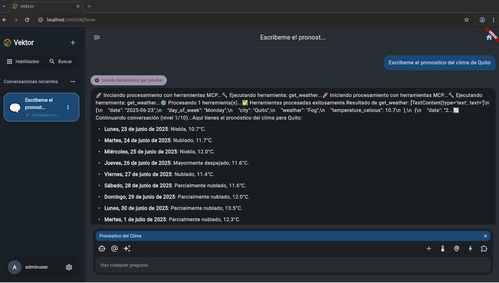
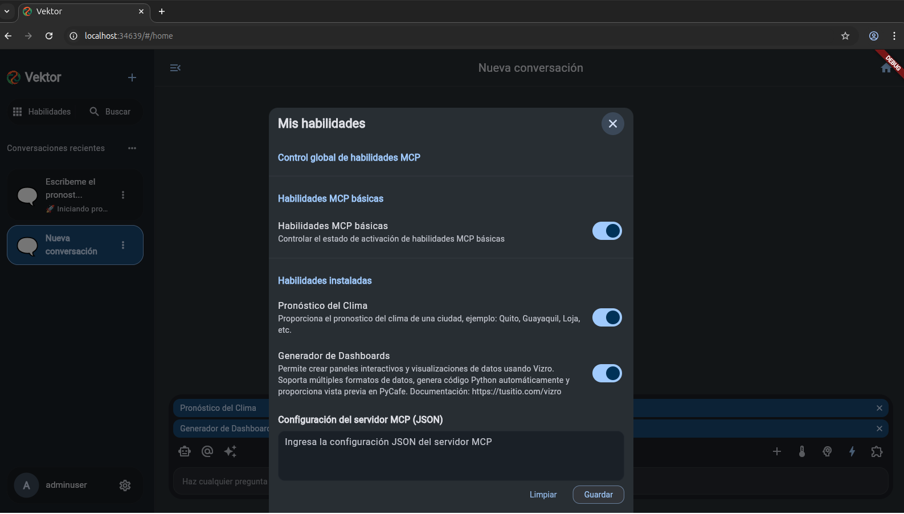

# Vektor Frontend

<div align="center">
  
  <h3>Interfaz de Usuario Flutter para Agente IA con Streaming Multi-Servidor</h3>
  <p>Experiencia de Usuario Moderna y Multilingüe</p>
</div>

<p align="center">
  🚀 <a href="https://chat.jintongshu.com/">Pruébalo en línea ahora</a>  |  <a href="https://jintongshu.com/download/">Descarga el cliente SaaS</a>
</p>
<p align="center">

</p>

---

## 🚀  Introducción

El frontend de Vektor es una aplicación Flutter moderna que proporciona una interfaz de usuario elegante y receptiva para interactuar con el agente IA. Ofrece una experiencia de chat en streaming en tiempo real, soporte multilingüe completo y una interfaz altamente personalizable con temas dinámicos Material 3.

<div align="center">
  
  <p><em>Interfaz principal de chat con streaming en tiempo real</em></p>
</div>

## 🚀 Características

- **Experiencia de Chat en Tiempo Real**: Visualización fluida de respuestas mediante streaming con indicadores de escritura.
- **Soporte Multi-Idioma**: Interfaz completamente localizada en inglés y español.
- **Modo de Pensamiento Profundo**: Interfaz especial para análisis avanzado en consultas complejas.
- **Diseño Adaptativo**: Funciona perfectamente en móviles, tabletas, escritorio y web.
- **Personalización de Temas**: Modo claro/oscuro, colores base personalizados y temas dinámicos Material 3.
- **Visualización de Archivos**: Soporte para adjuntar y visualizar archivos en conversaciones.
- **Gestión de Sesiones**: Sincronización de conversaciones entre dispositivos.

<div align="center">
  
  
  
  <p><em>Pantallas de configuración, gestor de aplicaciones y entorno</em></p>
</div>

## 🛠️ Stack Tecnológico Frontend

- **Framework**: Flutter (^3.7.2)
- **Gestión de Estado**: Provider
- **UI**: Material Design 3 con Widgets Personalizados
- **Localización**: flutter gen-l10n
- **Temas**: dynamic_color para temas Material You
- **HTTP**: dio para comunicación con API REST
- **Streaming**: EventSource para Server-Sent Events
- **Almacenamiento Local**: shared_preferences, flutter_secure_storage
- **Animaciones**: flutter_animate para transiciones fluidas

## 📋 Prerrequisitos para Desarrollo

- Flutter SDK ^3.7.2
- Dart ^3.0.0
- Editor: VS Code con extensiones Flutter y Dart, o Android Studio
- Para compilación nativa: Android SDK, Xcode (macOS)

## 🔧 Instalación y Configuración del Frontend

1. **Clonar el repositorio**:
   ```bash
   git clone https://github.com/Snayderstone/Vektor.git
   cd Vektor
   ```

2. **Instalar dependencias**:
   ```bash
   flutter pub get
   ```

3. **Generar archivos de localización**:
   ```bash
   flutter gen-l10n
   ```

4. **Configurar entorno**:
   - Copia `.env.example` a `.env` y configura las variables de entorno
   - Edita `lib/core/config/app_config.dart` para endpoints API

5. **Ejecutar en modo desarrollo**:
   ```bash
   flutter run
   ```

6. **Compilar para diferentes plataformas**:
   ```bash
   # Web (con soporte WASM para mejor rendimiento)
   flutter build web --wasm
   
   # Android
   flutter build apk --release
   
   # iOS (requiere macOS)
   flutter build ios --release
   
   # Desktop (Windows/macOS/Linux)
   flutter build windows --release
   flutter build macos --release
   flutter build linux --release
   ```

<div align="center">
  
  
  <p><em>Pantalla principal y tienda de complementos</em></p>
</div>

## 📁 Estructura de Directorios

```
lib/
├── core/
│   ├── config/             # Configuraciones globales
│   ├── constants/          # Constantes de la aplicación
│   ├── theme/              # Definiciones de temas
│   ├── services/           # Servicios base
│   └── utils/              # Utilidades reutilizables
├── features/
│   ├── auth/               # Autenticación
│   ├── chat/               # Funcionalidad de chat
│   ├── settings/           # Configuraciones de usuario
│   └── myapps/             # Gestión de aplicaciones
├── l10n/                   # Archivos de localización
├── shared/
│   ├── models/             # Modelos de datos
│   └── providers/          # Proveedores de estado
├── widgets/                # Widgets reutilizables
└── main.dart               # Punto de entrada
```

## 🎨 Personalización de Temas

El frontend de Vektor utiliza Material 3 con soporte completo para Material You en dispositivos Android compatibles. La personalización de temas incluye:

- **Detección Automática de Color**: Extracción de esquema de colores del fondo de pantalla
- **Selector de Color Semilla**: Personalización manual del color base
- **Modo Claro/Oscuro**: Con transiciones suaves
- **Densidad Personalizable**: Ajuste de espaciado para diferentes tamaños de pantalla

```dart
// Ejemplo de implementación de tema dinámico
ThemeData _buildTheme(ColorScheme? colorScheme, bool isDarkMode) {
  final defaultScheme = isDarkMode 
    ? ColorScheme.dark(primary: AppColors.primaryDark)
    : ColorScheme.light(primary: AppColors.primaryLight);
    
  final scheme = colorScheme ?? defaultScheme;
  
  return ThemeData(
    useMaterial3: true,
    colorScheme: scheme,
    // Configuraciones adicionales...
  );
}
```

## 🌐 Internacionalización

La aplicación soporta múltiples idiomas con traducción completa de la interfaz:

```dart
// Definición de localización
@override
Widget build(BuildContext context) {
  return MaterialApp(
    localizationsDelegates: AppLocalizations.localizationsDelegates,
    supportedLocales: AppLocalizations.supportedLocales,
    locale: _currentLocale,
    // ...
  );
}
```

Para añadir nuevos idiomas:
1. Crea nuevos archivos .arb en el directorio `lib/l10n/`
2. Ejecuta `flutter gen-l10n`
3. La aplicación detectará automáticamente los nuevos idiomas

## 📱 Navegación y Gestión de Estado

Vektor utiliza una combinación de Provider para gestión de estado y GoRouter para navegación:

```dart
// Ejemplo de navegación
GoRouter router = GoRouter(
  routes: [
    GoRoute(
      path: '/',
      builder: (context, state) => const HomeScreen(),
    ),
    GoRoute(
      path: '/chat/:id',
      builder: (context, state) => ChatScreen(
        chatId: state.params['id']!,
      ),
    ),
    // ...
  ],
);
```

## 🔄 Integración con Backend

El frontend se comunica con el backend a través de:

- **API REST**: Para operaciones CRUD estándar
- **Server-Sent Events**: Para streaming de chat en tiempo real

```dart
// Ejemplo de cliente SSE
class ChatService {
  Future<void> connectToStream() async {
    final token = await _authService.getToken();
    final uri = Uri.parse('${AppConfig.baseUrl}/chat/stream');
    
    _eventSource = EventSource(uri, 
      headers: {'Authorization': 'Bearer $token'}
    );
    
    _eventSource!.onMessage.listen((event) {
      // Procesar mensaje de streaming
      final data = jsonDecode(event.data!);
      _messageStreamController.add(data);
    });
  }
}
```

## 🔒 Seguridad del Frontend

- **Almacenamiento Seguro**: Tokens JWT almacenados en flutter_secure_storage
- **Expiración de Sesión**: Manejo automático de tokens expirados
- **Validación de Entrada**: Verificación de datos de formulario antes del envío
- **Sanitización de Salida**: Renderizado seguro de contenido potencialmente peligroso
- **Protección contra CSRF**: Tokens incluidos en encabezados de solicitud

## ⚡ Optimización de Rendimiento

- **Virtualización de Listas**: Para historial de chat extenso
- **Carga Perezosa de Imágenes**: Con placeholders y carga progresiva
- **Compilación Web WASM**: Para rendimiento superior en web
- **Widget Memorization**: Prevención de reconstrucciones innecesarias
- **Compresión de Activos**: Optimización de tamaño de archivos

## 📱 Capturas de Pantalla Adicionales

<div align="center">
  
  
  
  
  
  
</div>

## 🛣️ Hoja de Ruta del Frontend

- [x] Interfaz de chat en tiempo real con SSE
- [x] Soporte multilingüe (EN, ES)
- [x] Tema dinámico Material 3
- [x] Integración de MCP
- [ ] Soporte para múltiples layouts de chat
- [ ] Editor de prompts personalizado
- [ ] Integración de modo sin conexión
- [ ] Persistencia local mejorada
- [ ] Más idiomas soportados
- [ ] Modo accesibilidad avanzado

## 📱 Compatibilidad

- **Móvil**: Android 5.0+, iOS 11.0+
- **Web**: Navegadores modernos con soporte WebAssembly
- **Escritorio**: Windows 10+, macOS 10.15+, Ubuntu 20.04+

## 🤝 Contribuciones al Frontend

Las contribuciones al frontend son bienvenidas. Por favor, sigue estos pasos:

1. Haz fork del repositorio
2. Crea una rama para tu característica (`git checkout -b feature/amazing-feature`)
3. Asegúrate de que tu código sigue las convenciones de estilo
4. Ejecuta `flutter analyze` y `flutter test` para verificar tu código
5. Haz commit de tus cambios (`git commit -m 'Add some amazing feature'`)
6. Envía un Pull Request

## 📄 Licencia

Este proyecto está licenciado bajo la Licencia de Código Abierto de Vektor. Consulta el archivo [LICENSE](LICENSE) para más detalles.

